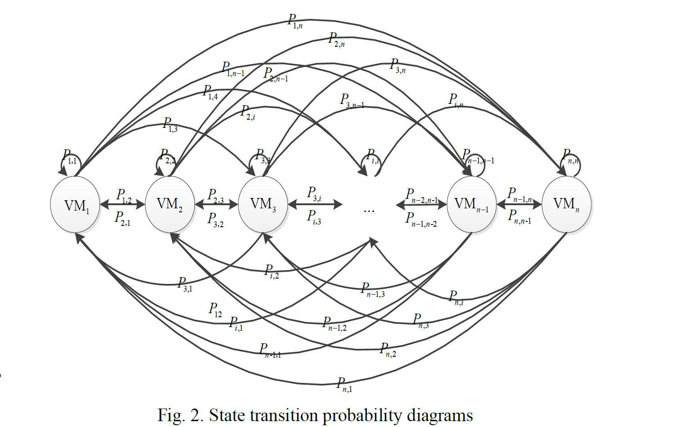
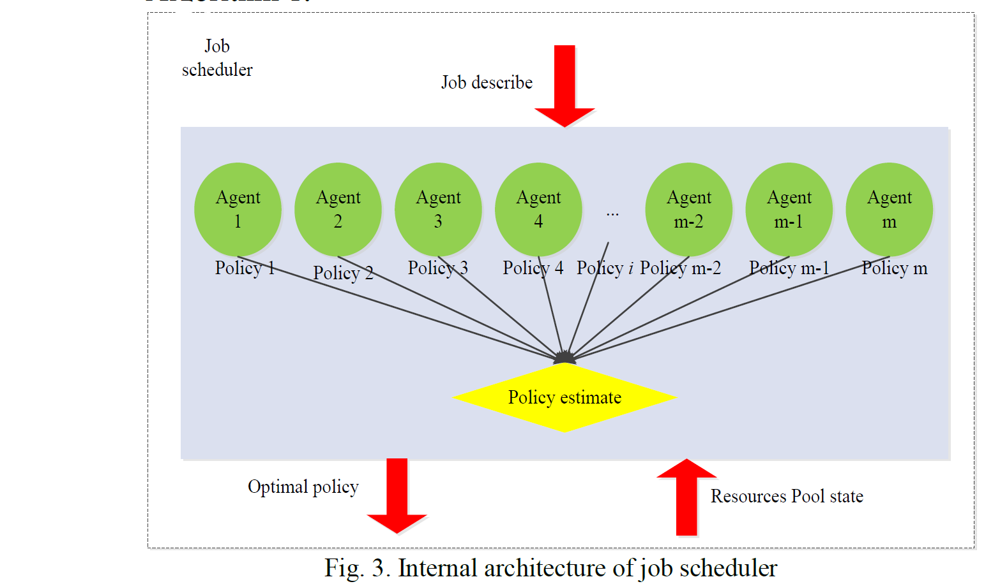
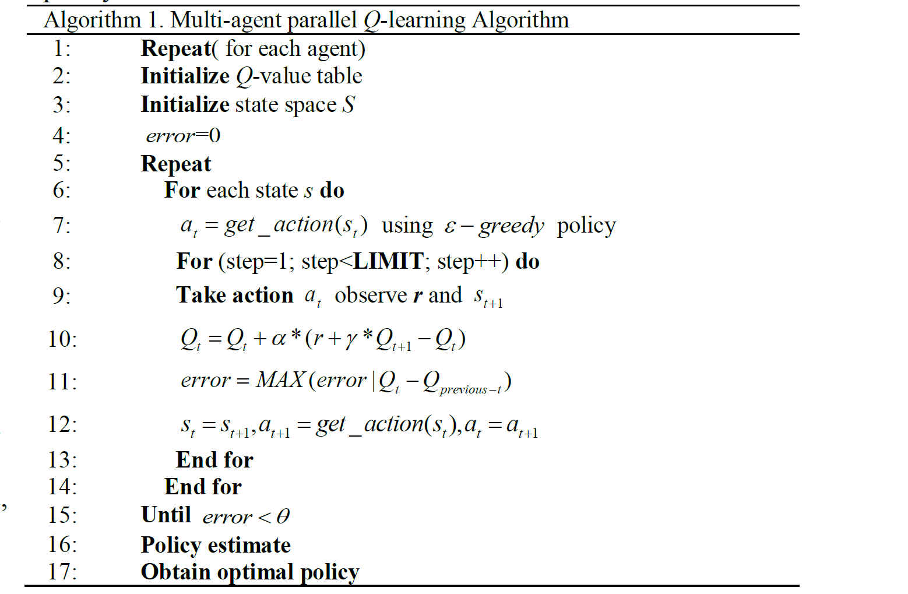
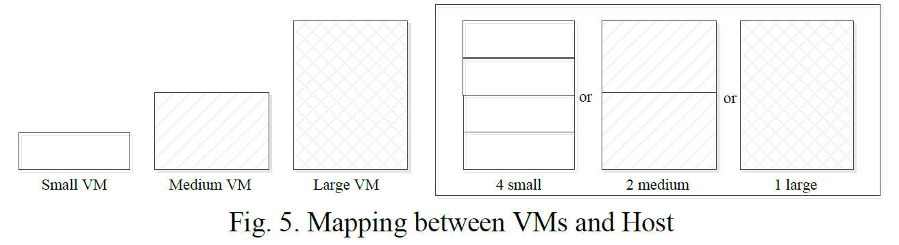

# A Reinforcement Learning-based Mixed Job Scheduler Scheme for Grid or IaaS Cloud

> Abstract—Job scheduling is a necessary prerequisite for performance optimization and resource management in the cloud computing system. Focusing on accurate scaled cloud computing environment and efficient job scheduling under Virtual Machine (VM) resource and Server Level Agreement (SLA) constraints, we introduce the architecture of cloud computing platform and optimization job scheduling scheme in this study. The system model is comprised of clearly defined separate constituent parts, including portal, job scheduler, and resources pool. By analyzing the execution process of user jobs, we designed a novel job scheduling scheme based on reinforcement learning to minimize the makespan and Average Waiting Time (AWT) under the VM resource and deadline constraints, and employ parallel multi-age parallel technologies to balance the exploration and exploitation in learning process and accelerate the convergence of Q-learning algorithm. Both simulation and real cloud platform experiment results demonstrate the efficiency of the proposed job scheduling scheme.
>
> Keywords—cloud computing, job scheduling, reinforcement learning, multi-agent, parallel learning, Q-learning, SLA

摘要—作业调度是云计算系统中性能优化和资源管理的必要先决条件。针对虚拟机（VM）资源和服务器级别协议（SLA）约束下的精确缩放的云计算环境和有效的作业调度，我们介绍了云计算平台的体系结构和优化作业调度方案。系统模型由明确定义的独立组成部分组成，包括portal?，作业计划程序和资源池。通过分析用户作业的执行过程，我们设计了一种基于强化学习的新型作业调度方案，以在VM资源和截止期限约束下最大程度地缩短工期和平均等待时间（AWT），并采用并行多年龄并行技术来平衡在学习过程中的探索和开发，并加快了Q学习算法的收敛速度。仿真和真实云平台实验结果均证明了所提出的作业调度方案的有效性。

关键字—云计算，作业调度，强化学习，多智能体，并行学习，Q学习，SLA 

## I. INTRODUCTION

> With mature virtualization technology, cloud computing manages to consolidate a considerable number of differently distributed servers, computing clusters, storage devices, network infrastructures, software systems and other IT resources into a unified logical virtual resource pool, which provides a good many users with all kinds of safe, reliable, low-cost, simple-delivery, highly scalable computing and storage services. Based on the pay per service, the users acquire the corresponding services from cloud computing systems via the Internet [1].
>
> Though job scheduling in cloud computing is quite similar to dispatching in the traditionally distributed environment, there are significant differences between them.

借助成熟的虚拟化技术，云计算可将大量不同分布的服务器，计算集群，存储设备，网络基础设施，软件系统和其他IT资源整合到一个统一的逻辑虚拟资源池中，从而为许多用户提供各种安全，可靠，低成本，简单交付，高度可扩展的计算和存储服务。基于每项服务的付费，用户可以通过Internet [1]从云计算系统中获取相应的服务。

尽管云计算中的作业调度与传统分布式环境中的调度非常相似，但它们之间还是存在很大差异。

> 1) Dynamics. Cloud resources change dynamically, with new Virtual Machine (VM) resources joining the cloud computing system and the existing ones exiting at any time, job scheduling scheme is supposed to be realtime monitoring of the changes of resources in a cloud computing environment; correspondingly, the computing resources scaled to schedule the jobs in the traditional distributed environment are fixed.

1）动态性。云资源是动态变化的，随着新的虚拟机（VM）资源加入云计算系统并且现有资源随时退出，作业调度方案应该是对云计算环境中资源变化的实时监控；相应地，在传统的分布式环境中，用于调度作业的计算资源是固定的。

> 2) Heterogeneity. The resources in the cloud computing environment are heterogeneous and diverse, which shield the differences amid resources through proven virtualization technology. The cloud computing system integrates resources into a unified logical resource pool, and offers external services. While in a traditional distributed environment, the computing resources are isomorphic. In addition, unlike the specific scheduling schemes for particular applications in a traditional distributed environment, the cloud computing job scheduling scheme, not limited to specific applications, can support multiple types of applications and can run them simultaneously.

2）异质性。云计算环境中的资源是异构且多样化的，通过成熟的虚拟化技术可以掩盖资源之间的差异。云计算系统将资源集成到统一的逻辑资源池中，并提供外部服务。在传统的分布式环境中，计算资源是同构的。此外，与传统分布式环境中针对特定应用程序的特定调度方案不同，云计算作业调度方案不限于特定应用程序，可以支持多种类型的应用程序并可以同时运行它们。

> 3) Complexity. The target in job scheduling under the traditional distributed environment is relatively simple, for it is merely focused upon the job completion time and the overall performance (such as the system throughput). While in the cloud computing environment, not only does the job scheduling strategy aim to increase the possible revenue for service providers, but also tries to meet the various application requirements for the resources and varied objectives of scheduling jobs.
>
> Generally speaking, cloud computing job scheduling strategy should meet the following requirements of scheduling objectives.

3）复杂性。传统分布式环境下的作业调度目标相对简单，因为它仅关注作业完成时间和整体性能（例如系统吞吐量）。在云计算环境中，作业调度策略不仅旨在增加服务提供商的可能收入，而且还试图满足对资源的各种应用需求和调度作业的各种目标。
一般而言，云计算作业调度策略应满足以下调度目标要求。

> 1) QoS/SLA constraint. Users will commonly sign an appropriate Service Level Agreement (SLA) with the cloud-based service providers when a job is scheduled. In the SLA, the Quality of Service (QoS) requirements of the job scheduling should be clearly stated, specifying the application deadline, job scheduling expenditure budget, system reliability, and service security [2]. Similarly, as data-intensive applications demand relatively higher requirements for network bandwidth, the corresponding requirements for communication bandwidth should also be stipulated in the SLA. Therefore, the QoS target constraints of the job scheduling must be fully considered to meet the QoS needs so as to get ultimate service revenue to guarantee the commercial success.

1）QoS / SLA约束。计划工作后，用户通常会与基于云的服务提供商签署适当的服务级别协议（SLA）。在SLA中，应明确说明作业调度的服务质量（QoS）要求，并指定应用程序截止日期，作业调度支出预算，系统可靠性和服务安全性[2]。同样，由于数据密集型应用程序对网络带宽的要求相对较高，因此SLA中也应规定对通信带宽的相应要求。因此，必须充分考虑作业调度的QoS目标约束，以满足QoS需求，从而获得最终的服务收入，以保证商业成功。

> 2) Load balancing. Different from the traditional distributed computing model which is only centered on the performance of completion time and system throughput, the cloud computing system is a commercial computing mode, aiming to expand service revenue as much as possible. How to decrease expenditure and optimize the utilization of resources in this system have become growing concerns for many scholars. Thus, it is essential to maintain the relatively balanced loads while job scheduling in order to achieve these goals.

2）负载均衡。与仅以完成时间和系统吞吐量为中心的传统分布式计算模型不同，云计算系统是一种商业计算模式，旨在最大程度地扩展服务收入。在该系统中，如何减少支出和优化资源利用已成为许多学者关注的问题。因此，至关重要的是在作业调度时保持相对平衡的负载，以实现这些目标。

> 3) Service revenue. The cloud computing system is equipped with large-scale infrastructures, including thousands and even millions of servers, resulting in higher input costs. For this reason, some of the economic principles and practices are introduced to cloud computing job scheduling, which accordingly appears more reasonable and performs more efficiently. Additionally, the management of cloud resources is more equitable and the allocation more economical, and thus promoting a healthier and more sustainable growth of the cloud computing market [3]. Therefore, by satisfying the resource requests and the QoS constraints, how to maximize service revenue has become another key goal of scheduling strategy for the cloud service providers.

3）服务收入。云计算系统配备了大规模基础架构，其中包括数千甚至上百万台服务器，从而导致更高的投入成本。因此，将一些经济性原则和实践引入了云计算作业调度中，因此看起来更加合理且执行效率更高。此外，云资源的管理更加公平，分配更加经济，从而促进了云计算市场更健康，更可持续的增长[3]。因此，通过满足资源请求和QoS约束，如何最大化服务收入已成为云服务提供商的调度策略的另一个关键目标。

> Due to large-scale servers, heterogeneous and diverse resources, extensive user groups, various types of application jobs and varied QoS target constraints, cloud computing systems are always dealing with massive jobs and data [4]. Under such a background, how to allocate and manage resources rationally and how to schedule the jobs efficiently in order that the massive jobs are able to be dispatched with a low cost expenditure in a relatively shorter time. Meanwhile, it has become a growing concern and one of the technical difficulties in the academic field to guarantee a high utilization of resources in cloud computing system and balance the overall loads [5]. Therefore, in this commercially services-based cloud computing model, an in-depth study on the scheduling strategies is not only theoretically valuable, but also practically significant.

由于大型服务器，异构和多样化的资源，庞大的用户组，各种类型的应用程序作业以及各种QoS目标约束，云计算系统始终在处理大量的作业和数据[4]。在这样的背景下，如何合理地分配和管理资源以及如何有效地安排工作，以便能够以相对较低的时间以低成本支出来分配大量工作。同时，保证云计算系统资源的高利用率并平衡整体负载已成为学术界日益关注的问题和技术难题之一[5]。因此，在这种基于商业服务的云计算模型中，对调度策略的深入研究不仅具有理论上的价值，而且具有实际意义。

> In this study, focusing on accurate scaled cloud computing environment and efficient job scheduling scheme under resource constraints, we introduce the architecture of cloud computing platform and job optimization scheduler scheme. The system model is comprised of clearly defined separate constituent parts, including portal, job scheduler, and resources pool. By analyzing the execution process of jobs, we design a novel job scheduling scheme based on reinforcement learning to minimize the makespan and Average Waiting Time (AWT) under the VM resources and deadline constraints, and employ multi-age parallel technologies to accelerate the learning progress and obtain the optimal solution.

在这项研究中，我们着重于在资源限制下的精确缩放的云计算环境和有效的作业调度方案，介绍了云计算平台的体系结构和作业优化调度器方案。系统模型由明确定义的独立组成部分组成，包括门户，作业计划程序和资源池。通过分析作业的执行过程，我们设计了一种基于强化学习的新颖作业调度方案，以在VM资源和截止期限约束下最大程度地缩短工期和平均等待时间（AWT），并采用多年龄并行技术来加快学习进度并获得最佳解决方案。

> The remainder of this paper is organized as follows: Section II discusses some related work. Section III presents cloud computing system model. Detailed descriptions of proposed job scheduling scheme are given in Section IV. Section V evaluates the performance of our scheme. Section VI concludes the paper and discusses future work.

本文的其余部分安排如下：第二部分讨论一些相关的工作。第三部分介绍了云计算系统模型。第四节对拟议的工作计划方案进行了详细说明。第五节评估了我们方案的性能。第六节总结了论文并讨论了未来的工作。

## II. RELATED WORKS

> As we all know, the job scheduling in grid and cloud environment has proven to be an Non-deterministic Polynomial (NP) hard complete problem [6]. Therefore, the optimization goals include optimal makespan, QoS, load balancing, and economic principles. Studies in the literature on this issue are mainly developed from the following aspects:

本文的其余部分安排如下：第二部分讨论一些相关的工作。第三部分介绍了云计算系统模型。第四节对拟议的工作计划方案进行了详细说明。第五节评估了我们方案的性能。第六节总结了论文并讨论了未来的工作。

> 1) Theoretical research. Theoretical research is usually combined with queuing theory or other statistical theory to construct a mathematical model of cloud computing systems, thus making theoretical analysis on job scheduling scheme. Khazaei, et al.[7] assumed that the service time had independent and identically distributed random variables, then the cloud computing center was modeled as an M/G/m/m+r queuing model. Hence, the probability distribution of the request response time and the relationship between the server number and input buffer size were obtained by embedded Markov chain, and related works had been done [8,9]. Outbreaking the traditional assumption on the known boundaries and job sizes, Maguluri, et al. [10] assumed job sizes were unknown, then presented a load balancing and scheduling algorithm that was to optimize throughput. Focusing on the unpredictable issues in large-scale scientific computing, Shi, et al. [11] designed an elastic resource provisioning and job scheduling algorithm under budget and deadline constraints, and evaluated the algorithm performance with real AMS experimental computing data under different budget constraints.

1）理论研究。通常将理论研究与排队论或其他统计理论相结合，以构建云计算系统的数学模型，从而对作业调度方案进行理论分析。Khazaei等人[7]假设服务时间具有独立且均匀分布的随机变量，则将云计算中心建模为M / G / m / m + r排队模型。因此，通过嵌入的马尔可夫链获得了请求响应时间的概率分布以及服务器数量和输入缓冲区大小之间的关系，并且已经完成了相关工作[8,9]。Maguluri等人突破了关于已知边界和工作规模的传统假设。[10]假定作业大小未知，然后提出了一种用于优化吞吐量的负载平衡和调度算法。Shi等人关注大型科学计算中不可预测的问题。[11]设计了一种在预算和期限约束下的弹性资源供应和作业调度算法，并在不同预算约束下利用真实的AMS实验计算数据评估了算法的性能。

> 2) Heuristics algorithm. Heuristics algorithm provides a viable strategy to solve the NP hard complete problem. Tordsson, et al. [12] proposed a cloud job scheduling and resource allocation method on a basis of particle swarm optimization, taking the two QoS constraints into account: the scheduling deadline and scheduling budget, with high versatility and scalability. Zheng, et al. [13] presented a cloud resource scheduling method based on parallel genetic algorithm, which could compress the overall execution time of a scheduled job, but it was easily stuck in local solution, thus having lower solution accuracy. Similar classical heuristic optimization algorithms were often employed to solve the job scheduling problems in cloud computing, such as genetic optimization algorithm [14] and particle swarm optimization algorithm [15, 16].

2）启发式算法。启发式算法为解决NP难完全问题提供了可行的策略。Tordsson等。[12]提出了一种基于粒子群优化的云作业调度和资源分配方法，同时考虑了两个QoS约束：调度期限和调度预算，具有较高的通用性和可扩展性。郑，等。[13]提出了一种基于并行遗传算法的云资源调度方法，该方法可以压缩调度作业的整体执行时间，但是很容易卡在本地解决方案中，从而降低了解决方案的准确性。相似的经典启发式优化算法通常用于解决云计算中的作业调度问题，例如遗传优化算法[14]和粒子群优化算法[15，16]。

> 3) Introduction of a new concept. A few concepts in other disciplines are also introduced to job scheduling in cloud computing. Aiming to solve the electricity cost problem, Li, et al. [17] established an economic model of cloud computing systems and designed a scheduling scheme of batch computing jobs. Kim, et al. [18] optimized the job scheduling using Biogeography-Based Optimization (BBO). BBO migration is used to change existing solutions and to adapt new good solutions. Recently, Game theory applied in job scheduling under cloud computing environment is increasingly in literature, and attracting more and more attention from researchers. Wooldridge [19] proposed a simple game theory model example to define the job scheduling in cloud computing environment. Mao, et al. [20] proposed a cloud service deployment scheme according to the game theory, but the scheme did not consider the network latency between computing resources. Palmieri, et al. [21] proposed a distributed scheduling approach to avoid the self-focused strategy of each provider. The agents’ behavior drove by game theory and Nash equilibrium solution, and the marginal cost were considered, and similar work had been done by Shie, et al. [22].

3）引入新概念。其他学科中的一些概念也被引入到云计算中的作业调度中。为了解决电费问题，李等人。[17]建立了云计算系统的经济模型，并设计了批处理作业的调度方案。Kim等。[18]使用基于生物地理的优化（BBO）来优化作业调度。BBO迁移用于更改现有解决方案并适应新的好的解决方案。近年来，在云计算环境下的工作调度中应用博弈论的文献越来越多，引起了研究者的越来越多的关注。Wooldridge [19]提出了一个简单的博弈论模型示例来定义云计算环境中的作业调度。毛等。[20]根据博弈论提出了一种云服务部署方案，但是该方案没有考虑计算资源之间的网络延迟。Palmieri等。[21]提出了一种分布式调度方法，以避免每个提供商的自我聚焦策略。代理人的行为是由博弈论和纳什均衡解驱动的，并考虑了边际成本，Shie等人也做了类似的工作。[22]。

> In summary, there has been a large amount of research done in literature regarding job scheduling under the cloud computing environment, but only a few schemes have focused on the hybrid operation of compute-intensive jobs and dataintensive jobs. In this study, a job scheduling scheme has been designed in terms of the hybrid operation in order to make up for the lack of relevant research.

总之，关于云计算环境下的作业调度，已有大量文献进行了研究，但只有少数方案专注于计算密集型作业和数据密集型作业的混合操作。在这项研究中，针对混合操作设计了一种工作计划方案，以弥补相关研究的不足。

## III. SYSTEMMODEL

> Fig. 1 illustrates the architecture of cloud computing platform which consists of the portal, job scheduler, and VMs clusters. The portal connects with the end users and cloud computing platform, and end users submit job requests through it. The job scheduler allocates the users job requests to a certain VM cluster. A VM cluster is composed of multiple virtual machine instances and it utilizes the allocated computation resources, such as CPU, memory and bandwidth to server each user job. The allocated resources of each VM are various, so the QoS and cost to each user job is not the same. The execution results of all jobs or the requested service information will be sent back to the portal, which will direct the execution results or the requested service information to the specific end users. Every constituent part of the cloud computing platform is connected with high-speed communication links, so the transmission time of user jobs in the cloud computing platform can be negligible.

图1说明了由门户，作业调度程序和VM集群组成的云计算平台的体系结构。门户与最终用户和云计算平台连接，最终用户通过门户提交工作请求。作业调度程序将用户作业请求分配给某个VM群集。VM群集由多个虚拟机实例组成，它利用分配的计算资源（例如CPU，内存和带宽）为每个用户作业提供服务器。每个VM分配的资源各不相同，因此每个用户作业的QoS和成本也不相同。所有作业的执行结果或请求的服务信息将被发送回门户，门户将把执行结果或请求的服务信息定向到特定的最终用户。云计算平台的每个组成部分都连接有高速通信链路，因此，用户作业在云计算平台中的传输时间可以忽略不计。

## IV. JOB SCHEDULING MECHANISM

> ### 4.1 Concept Description
>
> In order to facilitate the subsequent description, the relevant concepts of this job scheduling scheme are described as follow.
>
> The user job in cloud computing environment is described as $job_i(ini,fsize,deadline,avi)$ , in which $job_i.ini$,$job_i.fsize$,$job_i.deadline$,$job_i.avi$ represents the number of job instructions, the job size of input/output files, job deadline and job arrival time respectively. For compute-intensive jobs, its input/output file size is zero.
>
> The VM resource in cloud computing environment is described as $VM_j(proc,bw,avai)$,in which $VM_j.proc$,$VM_j.bw$,$VM_j.avai$ represents the VM processing speed, network bandwidth, and idle time respective.

4.1 概念描述

为了便于随后的描述，该作业调度方案的相关概念描述如下。

云计算环境中的用户作业描述为$ job_i（ini，fsize，deadline，avi）$，其中$ job_i.ini $，$ job_i.fsize $，$ job_i.deadline $，$ job_i.avi $代表作业指令的数量，输入/输出文件的作业大小，作业截止日期和作业到达时间。对于计算密集型作业，其输入/输出文件大小为零。

云计算环境中的VM资源描述为$ VM_j（proc，bw，avai）$，其中$ VM_j.proc $，$ VM_j.bw $，$ VM_j.avai $表示VM处理速度，网络带宽和各自的空闲时间。

> Assumption 1: All VMs are space-share type, i.e. a resource can be merely assigned to a job within the same time.
>
> Definition 1: Expected Execution Time (EET) is the execution time for each job in the VM under zero workload. It is predicted through a number of mechanisms to evaluate the performance; for example, analytical modeling, historical data and experience data provided by the user.

假设1：所有VM都是空间共享类型，即只能在同一时间内将资源分配给作业。

定义1：预期执行时间（EET）是VM在零工作负载下每个作业的执行时间。可以通过多种机制对性能进行预测，以评估性能。例如，用户提供的分析建模，历史数据和体验数据。

> For example, when $job_i$ is allocated to $VM_j$ , its EET denoted as $EET(job_i,VM_j)$ is 
> $$
> E E T\left(j o b_{i}, V M_{j}\right)=\frac{j o b_{i} \cdot i n i}{V M_{j} \cdot p r o c}+\frac{j o b_{i} \cdot f s i z e}{V M . b w}
> $$
> As for $VM_j$ , the available time for the next job is $VM_j.avai$. If $job_i$ is scheduled to $VM_j$ , the completion time $CT(i, j)$ can be expressed as
> $$
> C T\left(j o b_{i}, V M_{j}\right)=E E T\left(j o b_{i}, V M_{j}\right)+V M_{j}, \text { avai }
> $$
>
> To ensure the job is executed before deadline, so
> $$
> \operatorname{jud}\left(j o b_{i}, V M_{j}\right)=\left\{\begin{array}{ll}{1,} & {\text { if } \quad C T(i, j) \leq V M_{j}. \text { avai }+E E T(i, j)} \\ {0,} & {\text { if } \quad C T(i, j)>V M_{j} . a v a i+E E T(i, j)}\end{array}\right.
> $$
> If the value for $jud(job_i,VM_j)$ is 1， $job_i$ can be executed within the allocated resource $VM_j$ to meet the deadline; Otherwise, it cannot be executed.
>
> If the $job_i$ can be practically allocated to the resource $VM_j$ in the cloud computing platform, the time $VM_j.avai$ to receive the next job can be depicted as
> $$
> V M_{j} \cdot a v a i=E E T\left(j o b_{i}, V M_{j}\right)+V M_{j} . a v a i
> $$
> $VM_j.avai$ represents the time to receive the next job after $job_i$ is dispatched to the $VM_j$ resource. In fact, due to the difficulty in accurate estimation of the execution time in practical systems, this value is subject to the actual completion time.

例如，当将$ job_i $分配给$ VM_j $时，表示为$ EET（job_i，VM_j）$的EET为

$$
E E T\left(j o b_{i}, V M_{j}\right)=\frac{j o b_{i} \cdot i n i}{V M_{j} \cdot p r o c}+\frac{j o b_{i} \cdot f s i z e}{V M . b w}
$$
至于$ VM_j $，下一个作业的可用时间为$ VM_j.avai $。如果$ job_i $调度到$ VM_j $，则完成时间$ CT（i，j）$可以表示为
$$
C T\left(j o b_{i}, V M_{j}\right)=E E T\left(j o b_{i}, V M_{j}\right)+V M_{j}, \text { avai }
$$

为了确保作业在截止日期之前执行，所以
$$
\operatorname{jud}\left(j o b_{i}, V M_{j}\right)=\left\{\begin{array}{ll}{1,} & {\text { if } \quad C T(i, j) \leq V M_{j}. \text { avai }+E E T(i, j)} \\ {0,} & {\text { if } \quad C T(i, j)>V M_{j} . a v a i+E E T(i, j)}\end{array}\right.
$$
如果$ jud（job_i，VM_j）$的值为1，则$ job_i $可以在分配的资源$ VM_j $中执行，以满足期限；否则，将无法执行。

如果实际上可以将$ job_i $分配给云计算平台中的资源$ VM_j $，则接收下一个作业的时间$ VM_j.avai $可以表示为
$$
V M_{j} \cdot a v a i=E E T\left(j o b_{i}, V M_{j}\right)+V M_{j} . a v a i
$$
$ VM_j.avai $表示在将$ job_i $调度到$ VM_j $资源后接收下一个作业的时间。实际上，由于在实际系统中难以准确估计执行时间，因此该值取决于实际完成时间。

> Assumption 2: The jobs to be scheduled are meta jobs without any reliance on each other. A set of jobs to be scheduled is $Job=\left\{job_{1}, job_{2}, \ldots, job_{n}\right\}$ , and a set of virtual machines is $VM=\left\{VM_{1}, VM_{2}, \ldots, VM_{m}\right\}$ , where $n$ denotes the number of jobs and $m$ the number of VMs.
>
> More generally, assuming that each job has $l$ attributes, probably including bandwidth, memory, CPU, etc, the set of all jobs depicted as matrix $\mathbf{J}$ is
> $$
> J=\left\{\begin{array}{lll}{j o b_{1}. a tt_{1}} & {j o b_{1} . a t t_{2}} & {\dots} & {j o b_{1} \cdot a t t_{l}} \\ {\vdots} & {\vdots} & {\vdots} \\ {j o b_{i} \cdot a t t_{1}} & {j o b_{i} \cdot a t t_{2}} & {\dots} & {j o b_{i} \cdot a t t_{l}} \\ {\vdots} & {\vdots} & {\vdots} \\ {j o b_{n} \cdot a t_{1}} & {j o b_{n} \cdot a t t_{2}} & {\dots} & {j o b_{n} \cdot a t t_{l}}\end{array}\right\}
> $$
> Likewise, assuming that each VM has $l$ attributes, the set of all VMs depicted as matrix $VM$ is
> $$
> V M=\left\{\begin{array}{lll}{V M_{1} \cdot a tt_{1}} & {V M_{1} \cdot a t_{2}} & {\dots} & {V M_{1} \cdot a t t_{l}} \\ {\vdots} & {\vdots} & {\vdots} \\ {V M_{j} \cdot a t t_{1}} & {V M_{j} \cdot a t t_{2}} & {\dots} & {V M_{s} \cdot a t t_{l}} \\ {\vdots} & {\vdots} & {\vdots} \\ {V M_{m} \cdot a t t_{1}} & {V M_{m} \cdot a t t_{2}} & {\dots} & {V M_{m} \cdot a t t_{l}}\end{array}\right\}
> $$
> Given $JVM$ is a $l \times l$ dimension matrix, if all the attributes of $VM_j$ meet the requirements of $job_i$ , $JVM(job_i,VM_j)=1$ ; if not, $JVM(job_i,VM_j)=1$. Thus, $job_i$ can be performed in $VM_j$ on condition that
> $$
> \begin{array}{l}{\forall k, \quad V M_{j} \cdot a t t_{k}>j o b_{i} \cdot a t t_{k}, \quad 1<k<l, \quad 1<i<n, \quad 1<j<m} \\ {\text { According to the formula, we can get }} \\ {J V M\left(j o b_{i}, V M_{j}\right)=j u d\left(j o b_{i}, V M_{j}\right)}\end{array}
> $$
> 

假设2：要调度的作业是彼此无关的meta作业。一组要调度的作业为$Job = \left \{job_ {1}，job_ {2}，\ldots，job_ {n} \right \}$，一组虚拟机为 $ VM = \left\{VM_ {1}，VM_ {2}，\ldots，VM_ {m} \right \} $，其中$ n $表示作业数，$m$ 为VM数。

更笼统地说，假设每个作业具有$ l $属性，可能包括带宽，内存，CPU等，则描述为矩阵$ \mathbf {J} $的所有作业的集合为
$$
J=\left\{\begin{array}{lll}{j o b_{1}. a tt_{1}} & {j o b_{1} . a t t_{2}} & {\dots} & {j o b_{1} \cdot a t t_{l}} \\ {\vdots} & {\vdots} & {\vdots} \\ {j o b_{i} \cdot a t t_{1}} & {j o b_{i} \cdot a t t_{2}} & {\dots} & {j o b_{i} \cdot a t t_{l}} \\ {\vdots} & {\vdots} & {\vdots} \\ {j o b_{n} \cdot a t_{1}} & {j o b_{n} \cdot a t t_{2}} & {\dots} & {j o b_{n} \cdot a t t_{l}}\end{array}\right\}
$$
同样，假设每个VM具有$ l $属性，则表示为矩阵$ VM $的所有VM的集合为
$$
V M=\left\{\begin{array}{lll}{V M_{1} \cdot a tt_{1}} & {V M_{1} \cdot a t_{2}} & {\dots} & {V M_{1} \cdot a t t_{l}} \\ {\vdots} & {\vdots} & {\vdots} \\ {V M_{j} \cdot a t t_{1}} & {V M_{j} \cdot a t t_{2}} & {\dots} & {V M_{s} \cdot a t t_{l}} \\ {\vdots} & {\vdots} & {\vdots} \\ {V M_{m} \cdot a t t_{1}} & {V M_{m} \cdot a t t_{2}} & {\dots} & {V M_{m} \cdot a t t_{l}}\end{array}\right\}
$$
给定$ JVM $是一个$ l \times l$维矩阵，如果$ VM_j $的所有属性都满足$ job_i $的要求，则$ JVM（job_i，VM_j）= 1 $；如果不是，则$ JVM（job_i，VM_j）= 1 $。因此，在以下情况下，可以在$ VM_j $中执行$ job_i $
$$
\begin{array}{l}{\forall k, \quad V M_{j} \cdot a t t_{k}>j o b_{i} \cdot a t t_{k}, \quad 1<k<l, \quad 1<i<n, \quad 1<j<m} \\ {\text { According to the formula, we can get }} \\ {J V M\left(j o b_{i}, V M_{j}\right)=j u d\left(j o b_{i}, V M_{j}\right)}\end{array}
$$

> Definition 2: Makespan is defined as the amount of time for $VM_j$ , from start to finish, to execute the current batch of user jobs.
>
> Corollary 1: As for the job scheduling scheme in this study, the maximum makespan of all virtual machines is chosen to be the one for the current batch of user jobs.

定义2：Makespan定义为$VM_j$从开始到结束执行当前一批用户作业的时间。

推论1：至于本研究中的作业调度方案，所有虚拟机的最大有效期都选择为当前一批用户作业的最大有效期。

> Definition 3: Given $finish(job_i,VM_j)$ and $submit(job_i,VM_j)$ to represent the $job_i$ completion time and its submission time on the $VM_j$ respectively, its response time $TR(job_i,VM_j)$ is defined as
> $$
> R T\left(j o b_{i}, V M_{j}\right)=\text { finish }\left(j o b_{i}, V M_{j}\right)-\text { submit }\left(j o b_{i}, V M_{j}\right)
> $$
> The job response time reflects the real-time data processing of grid and cloud computing, so it becomes an important user’s concern for the quality of service, and one of the criteria for system performance evaluation. Therefore, it is one of the job scheduling goals to minimize the job scheduling scheme.

定义3：给定$ finish（job_i，VM_j）$和$ submit（job_i，VM_j）$分别表示$ job_i $完成时间和其在$ VM_j $上的提交时间，其响应时间$ TR（job_i，VM_j）$被定义为
$$
R T\left(j o b_{i}, V M_{j}\right)=\text { finish }\left(j o b_{i}, V M_{j}\right)-\text { submit }\left(j o b_{i}, V M_{j}\right)
$$
作业响应时间反映了网格和云计算的实时数据处理，因此它成为用户对服务质量的重要关注，也是系统性能评估的标准之一。因此，最小化作业调度方案是作业调度的目标之一。

> Definition 4: Given $submit(job_i,VM_j)$ and $start(job_i,VM_j)$ to represent the $job_i$ execution starting time and waiting time on the $VM_j$ respectively, the waiting time $WT(job_i,VM_j)$ is depicted as 
> $$
> W T\left(j o b_{i}, V M_{j}\right)=\operatorname{start}\left(j o b_{i}, V M_{j}\right)-\text { submit }\left(j o b_{i}, V M_{j}\right)
> $$
> The average waiting time is the mathematical expectation of all jobs’ waiting time, which reflects the average level of job waiting time. It is also one of the criteria for system performance evaluation [23].

定义4：给定$ submit（job_i，VM_j）$和$ start（job_i，VM_j）$分别表示$ job_i $在$ VM_j $上的执行开始时间和等待时间，等待时间$ WT（job_i，VM_j）$表示为
$$
W T\left(j o b_{i}, V M_{j}\right)=\operatorname{start}\left(j o b_{i}, V M_{j}\right)-\text { submit }\left(j o b_{i}, V M_{j}\right)
$$
平均等待时间是所有作业等待时间的数学期望，它反映了作业等待时间的平均水平。它也是系统性能评估的标准之一[23]。

> ### 4.2 Job scheduling Scheme
>
> As defined in section 4.1, the concepts such as state space, action space, immediate reward function denoted as S, A, and $r(s, a)$ respectively, can also be described as follows.

4.2 作业调度方案

如第4.1节所定义，状态空间，动作空间，分别表示为$S$，$A$和$r（s，a）$的即时奖励函数等概念也可以描述如下。

> State space. In this study, the number of available VMs for the jobs in cloud computing platform can be defined as state space. For instance, assuming that there are m active virtual machines in the current cloud computing platforms, state space can be represented by a vector in the form as:$s_i=(s_1,s_2,...,s_m)\in S$,where $s_j$ express $j^{th}$ VM. Theoretically, as long as the value of $jud(job_i,VM_j)$  is 1, the job can be assigned to any virtual machine which meets the resource constraints in the system, the current state of the system at the moment is merely relevant to the previous state. Hence the job scheduling problem can be cast as a MDP and the state transition probability diagram of cloud computing platform is shown in Fig. 2.

状态空间。在这项研究中，可以将云计算平台中作业可用的VM数量定义为状态空间。例如，假设当前的云计算平台中有m个活动虚拟机，则状态空间可以用以下形式的向量表示：$ s_i =（s_1，s_2，...，s_m）\in S $，其中$ s_j $表示$ j ^ {th} $个VM。从理论上讲，只要$ jud（job_i，VM_j）$的值为1，就可以将作业分配给任何满足系统资源限制的虚拟机，此时系统的当前状态仅与以前的状态。因此，可以将作业调度问题转换为MDP，而云计算平台的状态转移概率图如图2所示。

> Action space. For each user job, the action set can be described as (0/1), which means the current user job (reject/receive) by a certain VM. For example, if $i^{th}$ user job is assented to $j^{th}$ VM, the action space of $i^{th}$ user job can be represented by a vector in the form of $a_i=(0,0,1,0...,0) \in A$, which indicates current user job ( $i^{th}$ user job) is assigned to $3^{th}$ VM.

动作空间。对于每个用户作业，动作集可以描述为（0/1），这表示某个VM当前的用户作业（拒绝/接收）。例如，如果将用户作业分配给VM，则用户作业的动作空间可以由形式的向量表示，该向量指示当前用户作业（用户作业）已分配给VM。

> Immediate reward. The immediate reward is used to reflect the system running state and the job scheduling scheme running efficiency.
>
> For different job scheduling schemes, the main difference lies in scheduling jobs to various VM resources, so if $job_i$ is assigned to $VM_j$ , we define the $EET(job_i,VM_j)$ as immediate reward $r(job_i,VM_j)$ , we rewrite the Equation (1) as follow:
> $$
> r\left(j o b_{i}, V M_{j}\right)=\frac{j o b_{i} \cdot i n i}{V M_{j} \cdot p r o c}+\frac{j o b_{i} \cdot f s i z e}{V M \cdot b w}
> $$

立即奖励。立即奖励用于反映系统运行状态和作业调度方案的运行效率。

对于不同的作业调度方案，主要区别在于将作业调度到各种VM资源，因此，如果将$ job_i $分配给$ VM_j $，则将$ EET（job_i，VM_j）$定义为即时奖励$ r（job_i，VM_j）$，我们将等式（1）重写为：
$$
r\left(j o b_{i}, V M_{j}\right)=\frac{j o b_{i} \cdot i n i}{V M_{j} \cdot p r o c}+\frac{j o b_{i} \cdot f s i z e}{V M \cdot b w}
$$

> Optimization object function. As for the current batch of user jobs, the issue on job scheduling scheme optimization object function can be defined as
> $$
> \begin{align}
> \DeclareMathOperator*{\Min}{Min}
> & \Min_{\{awt\}}\Min_{\{mks\}}(Max(VM_i|VM_i\in S)) \\
> & subject \ to  \\
> & \quad \quad \quad \sum_{j=1}^m VM_i^j \le deadline
> \end{align}
> $$

优化对象函数。对于当前的用户作业批次，可以将作业调度方案优化对象函数的问题定义为
$$
\begin{align} \DeclareMathOperator*{\Min}{Min} & \Min_{\{awt\}}\Min_{\{mks\}}(Max(VM_i|VM_i\in S)) \\ & subject \ to  \\ & \quad \quad \quad \sum_{j=1}^m VM_i^j \le deadline \end{align}
$$

-----

注：

awt表示average waiting time

mks表示makespan

-----

> We employ the $Q$-learning [24] method as our optimization scheduling scheme. By continuous interactions with the environment and tryouts, $Q$-learning evaluates the feedback from the environment to optimize future decision-making. Characterized by on-line learning, modeling-free, with the greatest long-term cumulative reward instead of immediate one, it has become one of the most important methods in reinforcement learning, especially for the learners who know little about the surroundings, and self-adapt to learning in a dynamic, complex environment. In light of the continuously cumulative formats, after each immediate reward $r$ is collected, the mean $Q$-value of an action a on state s, denoted by $Q(s, a)$, can be refined at once:
> $$
> Q\left(s_{t}, a_{t}\right)=Q\left(s_{t}, a_{t}\right)+\alpha *\left[r_{t+1}+\gamma * Q\left(s_{t+1}, a_{t+1}\right)-Q\left(s_{t}, a_{t}\right)\right]
> $$
> where α is a learning rate parameter that facilitates convergence to the true Q-values in the presence of noisy or stochastic rewards and state transitions [23], and the discount rate is denoted by γ to guarantee the updated reward convergence in continuing job.

我们采用$ Q $ -learning [24]方法作为我们的优化调度方案。通过与环境和测试的持续交互，$ Q $学习评估来自环境的反馈以优化未来的决策。它具有在线学习，无需建模，具有最大的长期累积奖励而不是即时奖励的特点，它已成为强化学习中最重要的方法之一，特别是对于对周围环境和自我知之甚少的学习者而言-适合在动态，复杂的环境中学习。根据连续累积的格式，在收集到每个立即奖励$ r $之后，可以立即细化状态s上的动作a的平均$ Q $值，用$ Q（s，a）$表示：
$$
Q\left(s_{t}, a_{t}\right)=Q\left(s_{t}, a_{t}\right)+\alpha *\left[r_{t+1}+\gamma * Q\left(s_{t+1}, a_{t+1}\right)-Q\left(s_{t}, a_{t}\right)\right]
$$
其中，$α$是学习率参数，在存在嘈杂或随机奖励以及状态转换的情况下，有助于收敛到真实的Q值[23]，折扣率由$γ$表示，以确保连续工作中更新的奖励收敛。

> The numbers of VMs and user jobs in cloud computing environment are very high, meanwhile the job scheduling problem is a NP hard completed problem, so we employ multi-agent parallel learning to accelerate the job optimization scheduler scheme. The designed internal architecture of the job scheduler is shown in Fig. 3, and the pseudo code of the multi-agent parallel Q-value learning algorithm is illustrated in Algorithm 1.

云计算环境中的虚拟机和用户作业数量很高，同时作业调度问题是一个NP难题，因此，我们采用多智能体并行学习来加速作业优化调度器方案。作业调度程序的设计内部架构如图3所示，而多智能体并行Q值学习算法的伪代码如图1所示。

> As shown in Fig. 3 and Algorithm 1, each agent learns the optimal scheduler scheme by employing Q-learning algorithm, and obtains a suboptimal policy when an episode is over. Then each agent updates Q-value table itself according to the estimated results. The suboptimal policy of each agent is estimated by policy estimate model, and obtains wholesituation optimal policy. If the learning progress is not finished, the optimal scheme updates the Q-value table for each agent. This method of updating balances the exploration and exploitation effectively; otherwise, it outputs the optimal policy.

如图3和算法1所示，每个智能体通过采用Q学习算法来学习最佳调度器方案，并在情节结束时获得次优策略。然后，每个代理根据估计结果自己更新Q值表。通过策略估计模型对每个代理的次优策略进行估计，得到总体最优策略。如果学习进度尚未完成，则最佳方案将为每个代理更新Q值表。这种更新方法有效地平衡了勘探和开发；否则，输出最佳策略。

> Based on our preliminary work [25-27], we redesign the agent and the internal architecture of an agent as shown in Fig.4 . The action of each agent is taken depending on the decision of the rule bank, in which user data, history rule, Q-value table and knowledge transferred from other agents are included.
>
> By using the job scheduling scheme proposed in this paper, the user job scheduling process is to look up Q-value table, which is built and maintained by Q-learning algorithm, and to make a decision, so the time complexity of the proposed job scheduling in this paper is O(1).

根据我们的初步工作[25-27]，我们重新设计了智能体和智能体的内部架构，如图4所示。根据规则库的决定采取每个智能体的动作，其中包括用户数据，历史记录规则，Q值表和从其他智能体传递来的知识。

通过使用本文提出的作业调度方案，用户作业调度过程是查找由Q学习算法建立和维护的Q值表，并做出决策，因此所提出作业的时间复杂度本文中的调度是O（1）。

## V. EXPERIMENT RESULTS

> To evaluate the efficiency of our approach, implementations have been performed on the simulation and real cloud computing environment, respectively.
>
> First, by using numerical analysis function of MATLAB R2012a by MathWorks, Inc.[28], we have developed a discrete event simulator of the cloud server platform. Second, we employ CloudSim Toolkit [29], which is widely regarded as benchmark of cloud computing simulation experiments environment. Third, we construct real cloud computing platform by using physical machines. In our replication experiment, different types of VMs mapped to a physical machine are shown in Fig. 5.

为了评估我们方法的效率，分别在模拟和真实云计算环境上执行了实现。

首先，通过使用MathWorks公司的MATLAB R2012a的数值分析功能[28]，我们开发了云服务器平台的离散事件模拟器。其次，我们使用CloudSim Toolkit [29]，它被广泛认为是云计算仿真实验环境的基准。第三，我们使用物理机构建真正的云计算平台。在我们的复制实验中，图5中显示了映射到物理机的不同类型的VM。

