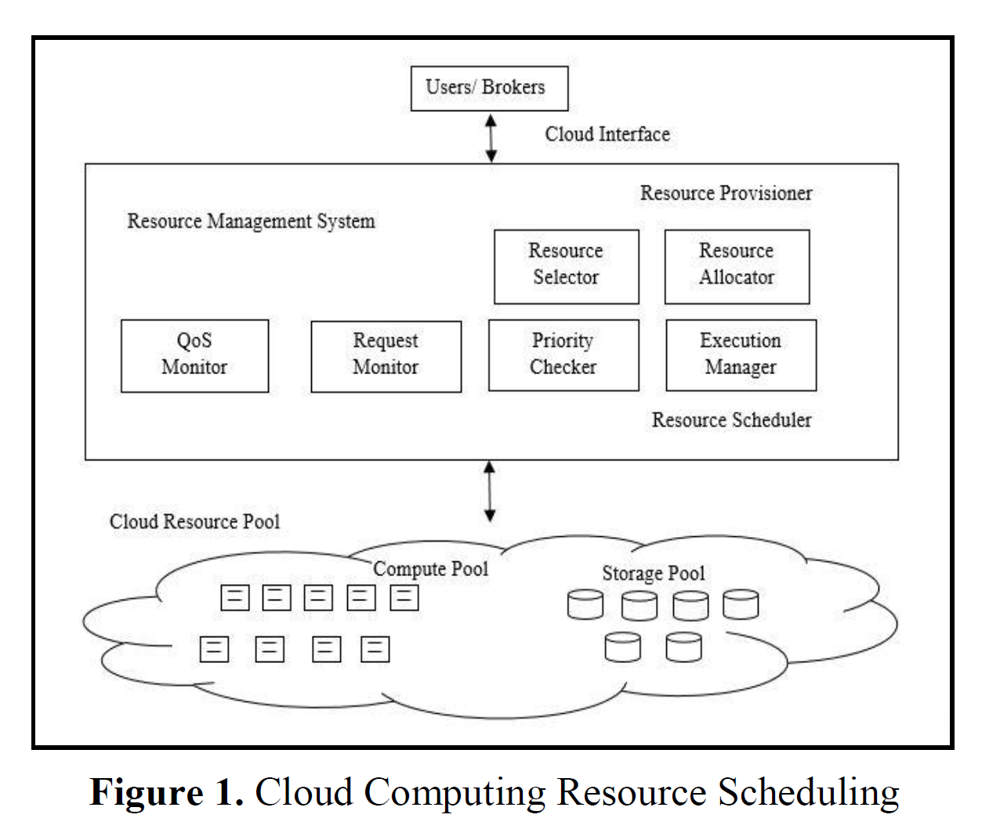

# A Survey on Resource Scheduling Algorithms in Cloud Computing

## Abstract

>  Cloud Computing is a distributed computing paradigm that provides computing i.e. processing, storage, services, network, and applications in an abstracted, virtualized, managed, and dynamically demand driven manner using Internet. It offers several distinguished features like virtualization, heterogeneity, measured service, pricing, resource pooling and elasticity. The explosive demand of cloud computing has led to the need of carefully managing the resources that provide services to the users. Resource Scheduling deals with this notion. It refers to the process of appropriate generation of the schedule that decides which tasks will be mapped on to which resources. In this paper, we describe all the important resource scheduling approaches that aim at optimizing the user Quality of Service (QoS) metrics such as cost, makespan, reliability, priority etc. An exhaustive survey on the approaches that tend to improve the user QoS metrics has been conducted. The deterministic, linear and evolutionary approaches to resource scheduling have been described along with the detailed comparison among these approaches.
> Keywords: User QoS, Resource Scheduling, Deterministic approaches, Evolutionary approaches.

云计算是一种分布式计算范例，可使用Internet以抽象，虚拟化，托管和动态需求驱动的方式提供计算，即处理，存储，服务，网络和应用程序。它提供了许多杰出的功能，例如虚拟化，异构性，可衡量的服务，定价，资源池和弹性。云计算的爆炸性需求导致需要仔细管理为用户提供服务的资源。资源调度处理了这个概念。它指的是适当生成时间表的过程，该过程决定将哪些任务映射到哪些资源。在本文中，我们描述了所有旨在优化用户服务质量（QoS）指标（例如成本，有效期，可靠性，优先级等）的重要资源调度方法。对旨在改善用户QoS指标的方法的详尽调查已经进行了。已经描述了确定性，线性和进化性的资源调度方法以及这些方法之间的详细比较。

## CLOUD RESOURCE SCHEDULING PROBLEM

> If we talk about resources, these refer to any component that can provide service to a user in any manner, may be it physical resource (e.g. processor, memory, storage, network elements, workstations etc.) or logical resource (e.g. operating system, energy, throughput, bandwidth etc.). Management of these resources involves both efficient provisioning and scheduling. Resource Provisioning refers to the process of appropriate detection, selection and allocation of resources that are needed to run the tasks and workflows. Resource scheduling is the process of appropriate generation of the schedule that decides which tasks will be mapped on to which resources. Both these procedures closely relate to adhering to Service Level Agreements and satisfying Quality of Service. In this paper, we concentrate on resource scheduling phase and on approaches that are meant to generate effective schedules.

如果我们谈论资源，则它们是指可以以任何方式向用户提供服务的任何组件，可能是物理资源（例如处理器，内存，存储器，网络元素，工作站等）或逻辑资源（例如操作系统，能量，吞吐量，带宽等）。这些资源的管理涉及有效的供应和调度。资源配置是指适当地检测，选择和分配运行任务和工作流所需的资源的过程。资源调度是适当生成调度的过程，该调度决定将哪些任务映射到哪些资源。这两个过程都与遵守服务水平协议和满足服务质量紧密相关。在本文中，我们专注于资源调度阶段以及旨在生成有效调度的方法。

> The Resource Scheduling phenomenon is depicted by Fig. 1. Users or brokers on behalf of users submit tasks or workflows on the cloud computing environment using the cloud interface. Now the responsibility lies on the Resource Management System (RMS) to keep track of the status of tasks submitted, the number of resources required, maintaining the SLAs and successful completion of the tasks. Resource Provisioner carefully selects the resources for the tasks. When these resources are successfully provided for the execution, RMS calls resource scheduler. Various interactive components of resource scheduler include QoS monitor, execution manager, request monitor and priority checker.

图1描绘了资源调度现象。用户或代理代表用户使用云接口在云计算环境上提交任务或工作流。现在，责任在于资源管理系统（RMS），以跟踪提交的任务的状态，所需的资源数量，维护SLA以及成功完成任务。资源配置器会仔细选择任务的资源。成功提供这些资源以供执行时，RMS会调用资源调度程序。资源调度程序的各种交互式组件包括QoS监视器，执行管理器，请求监视器和优先级检查器。

> Resource scheduling algorithms can be classified into several types on the basis of goal which they are fulfilling. Some researchers classify algorithms on the basis of layers upon which they work i.e. scheduling in the Infrastructure Layer, Platform Layer, and Software Layer. Some researchers classify algorithms on the basis of information needed for scheduling i.e. static and dynamic algorithms. Depending on the type of data on which the algorithms work, they can be classified into independent task scheduling and workflow scheduling. Here, workflow refers to a set of interdependent tasks in which the successful completion of all the tasks cause the workflow to complete. Depending on the type of methods used, the scheduling algorithms are classified into deterministic and stochastic algorithms. Whilst in deterministic algorithms, computing is based on certain mathematical rules that cannot be modified and the search is done only in one direction, in stochastic algorithms, heuristic search depends on the judgment of the person concerned to find the solution and random search technique is used with no pre-defined rule. While there are many user QoS attributes based on which the algorithms are classified such as cost, time, reliability, priority, budget, deadline, SLA, there are some parameters from the providers’ end also such as energy, bandwidth, efficiency, profit, load balance, resource utilization, cost effectiveness, and negotiation. In this paper, we focus primarily on various linear and evolutionary strategies that focus 6at optimizing the users’ QoS attributes.

资源调度算法可以根据其实现的目标分为几种类型。一些研究人员根据其工作的层对算法进行分类，即在基础结构层，平台层和软件层中进行调度。一些研究人员基于调度所需的信息对算法进行分类，即静态和动态算法。根据算法工作的数据类型，可以将它们分为独立的任务计划和工作流程计划。这里，工作流是指一组相互依赖的任务，其中所有任务的成功完成导致工作流完成。根据所用方法的类型，调度算法分为确定性算法和随机算法。在确定性算法中，计算基于某些不可修改的数学规则，并且仅在一个方向上进行搜索，而在随机算法中，启发式搜索取决于相关人员的判断以找到解决方案，并且使用随机搜索技术没有预先定义的规则。虽然根据算法对用户QoS属性进行了分类，例如成本，时间，可靠性，优先级，预算，期限，SLA，但提供商的一些参数还包括能源，带宽，效率，利润，负载平衡，资源利用，成本效益和协商。在本文中，我们主要关注各种线性和进化策略，这些策略专注于6优化用户QoS属性。

*静态调度所需仅需要系统平均情况的信息，忽略系统当前状态或负载，而动态调度会考虑状态信息，并在状态发生变化时做出反应；静态算法比较简单，动态算法对性能提升更好。*

> Coming back to RSP, it can be thought of as a function that maps jobs/tasks (say, we have a set of tasks $x_1,x_2,x_3,...,x_n$) to a set of resources (Virtual Machines (VMs)) (say, we have a set of VMs $v_1,v_2,v_3,...v_m$) such that the objective function is minimized/maximized. The jobs may be independent of one another or may consist of a sequence of tasks that are interdependent on each other. The objective function depends on user requirements and SLA agreements. The objective function may depend on just one parameter or it may depend on several parameters. The objective function is either weighed according to different parameters or the parameters are to be considered independently. The solution is to be found out within a given time frame. RSP is known to be a NP-hard problem [7] i.e. these problems cannot be solved in linear time frame with the increase in dimensions and complexity. Thus, researchers started using evolutionary approaches such as Genetic Algorithms, Particle Swarm Optimization, and Ant Colony Optimization to gain a better solution with a better speed of convergence. We firstly describe various linear strategies. Then, we move on for elaborating the nature inspired and metaheuristic algorithms that tend to tackle RSP.

回到RSP，可以将其视为将作业/任务（例如，我们有一组任务$ x_1，x_2，x_3，...，x_n $）映射到一组资源（虚拟机（VM））（例如，我们有一组VM $ v_1，v_2，v_3，... v_m $），从而使目标函数最小/最大化。这些作业可以彼此独立，也可以由彼此相互依赖的一系列任务组成。目标功能取决于用户要求和SLA协议。目标函数可能仅取决于一个参数，也可能取决于多个参数。根据不同的参数对目标函数进行加权，或者独立考虑这些参数。该解决方案将在给定的时间范围内找到。已知RSP是一个NP难题[7]，即随着尺寸和复杂性的增加，这些问题无法在线性时间范围内解决。因此，研究人员开始使用进化方法，例如遗传算法，粒子群优化和蚁群优化，以更快的收敛速度获得更好的解决方案。我们首先描述各种线性策略。然后，我们继续阐述倾向于解决RSP的自然启发式和元启发式算法。