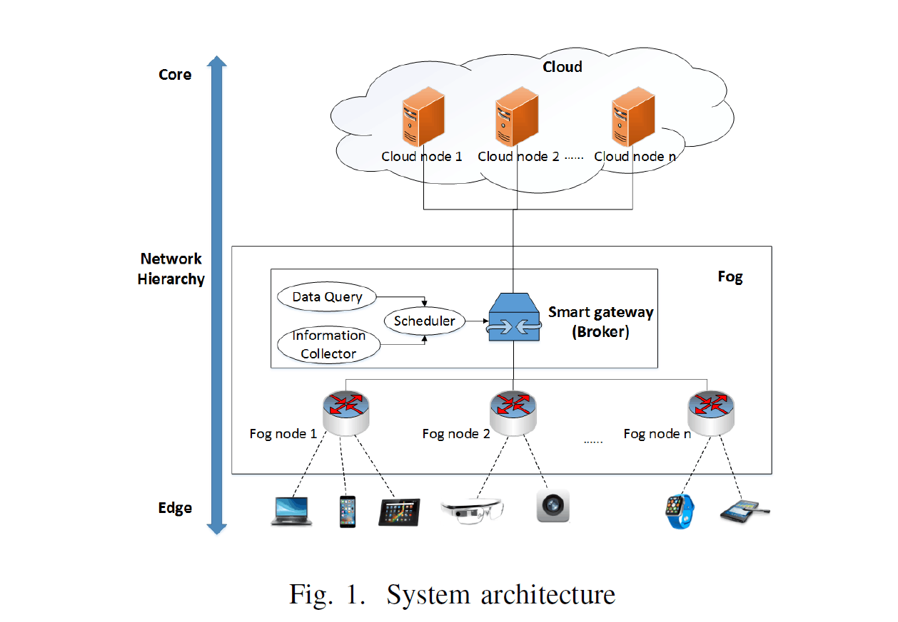
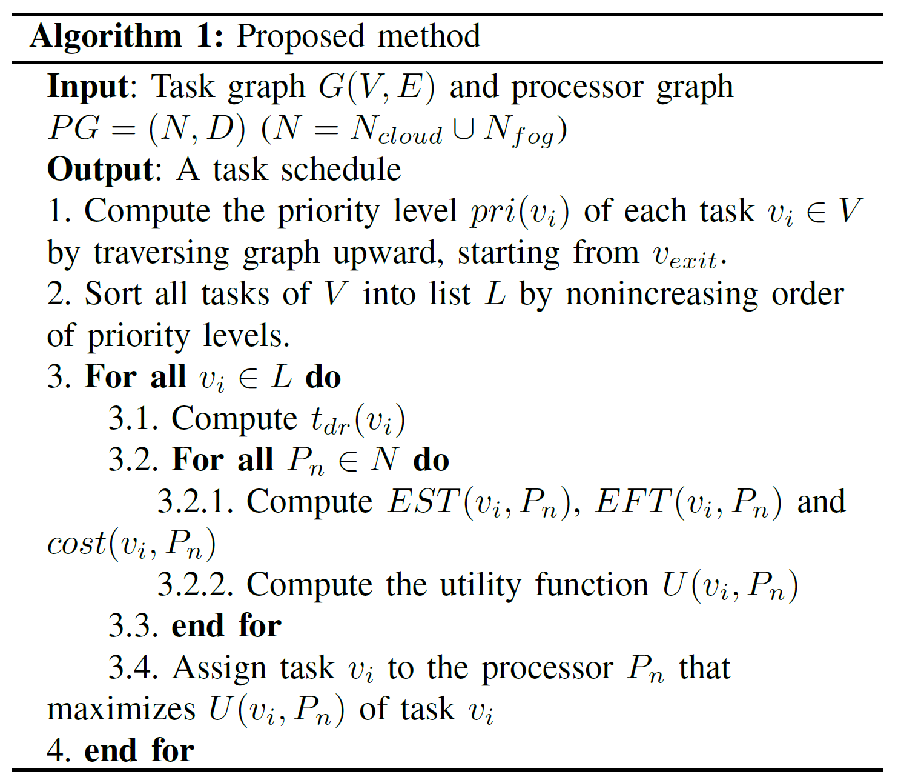
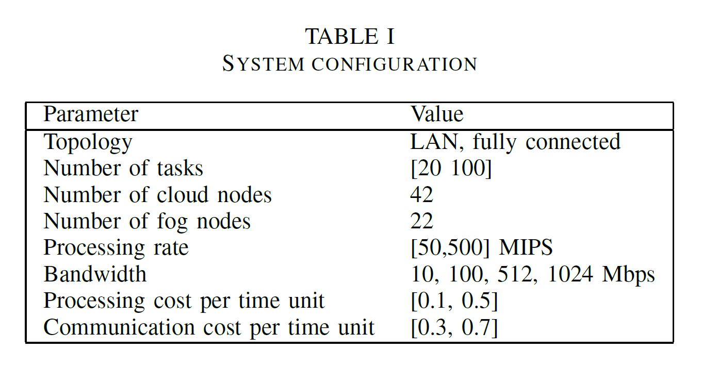
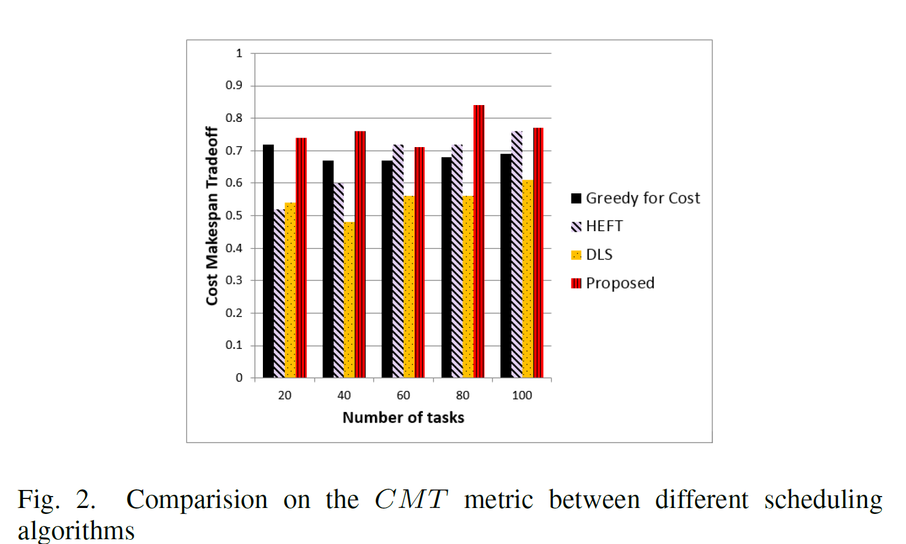

# Towards task scheduling in a cloud-fog computing system

> Abstract—In recent years, with the advent of the Internet of Things (IoT), fog computing is introduced as a powerful complement to the cloud to handle the IoT’s data and communications needs. The interplay and cooperation between the edge (fog) and the core (cloud) has recently received considerable attention. In this paper, we consider task scheduling in a cloud-fog computing system, where a fog provider can exploit the collaboration between its own fog nodes and the rented cloud nodes for efficiently executing users’ large-scale offloading applications. We first formulate the task scheduling problem in such cloud-fog environment and then propose a heuristic-based algorithm, whose major objective is achieving the balance between the makespan and the monetary cost of cloud resources. The numerical results show that our proposed algorithm achieves better tradeoff value than other existing algorithms.
> Index Terms—cloud computing, fog computing, task scheduling, Internet of Things.

摘要——近年来，随着物联网（IoT）的出现，雾计算被引入作为对云的强大补充，以处理物联网的数据和通信需求。边缘（雾）和核心（云）之间的相互作用和协作最近受到了相当大的关注。在本文中，我们考虑了云雾计算系统中的任务调度，在该系统中，雾提供者可以利用其自身的雾节点与租用的云节点之间的协作来高效执行用户的大型卸载应用程序。我们首先在这种云雾环境中制定任务调度问题，然后提出一种基于启发式的算法，其主要目的是在云资源的制造期和货币成本之间取得平衡。数值结果表明，与现有算法相比，本文算法具有更好的折衷价值。
索引词-云计算，雾计算，任务调度，物联网。

## I. INTRODUCTION

> Fog computing is a promising solution to deal with the demands of the ever-increasing number of Internet-connected devices. The idea of fog computing is to extend the cloud to be closer to the things that produce and act on IoT data. Instead of forcing all processing to back-end clouds, fog computing aims to process part of the services’ workload locally on fog nodes, which are served as a near-end computing proxies between the front-end IoT devices and the back-end cloud servers. Putting resources at the edge of the network only one or two hops from the data sources allows fog nodes to perform low latency processing while latency-tolerant and large-scale tasks can still be efficiently processed by the cloud. In addition, the cost and scale benefits of the cloud can help the fog to serve peak demands of IoT devices if the resources of fog nodes are not sufficient. Also, many applications require the interplay and cooperation between the edge (fog) and the core (cloud), particularly for the IoT and big data analysis [1]. From this point of view, fog computing is not aimed to replace cloud computing, but to complement it in a new computing paradigm, cloud-fog computing, which is to satisfy the increasingly sophisticated applications demanded by users.

雾计算是一种有前途的解决方案，可以满足越来越多的Internet连接设备的需求。雾计算的想法是扩展云，使其更接近于产生和作用于IoT数据的事物。雾计算不是将所有处理都强加到后端云，而是旨在在雾节点上本地处理部分服务工作负载，这些雾节点用作前端物联网设备和后端云服务器之间的近端计算代理。将资源放在网络边缘仅距离数据源一跳或两跳，可使雾节点执行低延迟处理，而云仍然可以有效处理延迟等待和大规模任务。此外，如果雾节点的资源不足，云的成本和规模优势可帮助雾满足物联网设备的峰值需求。另外，许多应用程序需要边缘（雾）和核心（云）之间的相互作用和协作，特别是对于物联网和大数据分析[1]。从这个角度来看，雾计算的目的不是替代云计算，而是在一种新的计算范例云雾计算中对其进行补充，以满足用户日益复杂的应用程序的需求。

> In this paper, we consider task scheduling in a cloud-fog computing system, where a fog provider can exploit the collaboration between its fog nodes and the rented cloud nodes for efficiently executing users’ large-scale offloading  applications. The fog nodes are local resources, which can be any devices with computing, storage, and network connectivity such as switches, routers, video surveillance cameras, etc. A simple scenario is that a shopping center can deploy many fog nodes in different floors to provide WiFi access and deliver some engaged services (i.e. indoor navigation, ads distribution, feedback collections) to its customers. However, in peak time, the capabilities of those fog nodes cannot efficiently serve the customers. Meanwhile, the fog provider, here is the shopping center, can extend its infrastructure by paying for the outsourced computation and storage resources of the cloud nodes, which can be virtual machine (VM) rented from cloud providers on a pay-per-use basis. All distributed processing nodes (cloud or fog) are managed by a resource broker, which is a resource management component and scheduler for the workflows submitted from users at the fog’s side. In this case, a task schedule, which can minimize the completion time of the workflow, but corresponds to a large amount of monetary cost, is not an optimal solution for fog providers. Thus, in this paper, we propose a task scheduling algorithm that can achieve a good tradeoff between the workflow execution time and the cost for the use of cloud resources. The experimental results show the outstanding performance of our method compared with some other works.

在本文中，我们考虑了cloud-fog计算系统中的任务调度，在该系统中，雾服务提供商可以利用其雾节点与租用云节点之间的协作来有效执行用户的大型卸载应用程序。雾节点是本地资源，可以是具有计算，存储和网络连接功能的任何设备，例如交换机，路由器，视频监控摄像机等。一个简单的场景是购物中心可以在不同楼层部署许多雾节点以提供WiFi访问并向其客户提供一些互动服务（例如室内导航，广告分发，反馈收集）。但是，在高峰时间，这些雾节点的功能无法有效地为客户服务。同时，雾提供商（这里是购物中心）可以通过支付云节点的外包计算和存储资源来扩展其基础架构，云节点可以是按使用量付费从云提供商租用的虚拟机（VM）。所有分布式处理节点（云或大雾）均由资源代理管理，资源代理是大雾侧用户提交的工作流的资源管理组件和调度程序。在这种情况下，任务计划表不是雾提供商的最佳解决方案，该任务计划表可以最大程度地缩短工作流程的完成时间，但要花大量的金钱成本。因此，在本文中，我们提出了一种任务调度算法，该算法可以在工作流执行时间和云资源的使用成本之间取得良好的折衷。实验结果表明，与其他一些工作相比，我们的方法具有出色的性能。

> The remainder of the paper is organized as follows. In section 2, we introduce some related works to the task scheduling problem in heterogeneous environments. The architecture of the cloud-fog computing system is described in section 3. In section 4, we formulate the task scheduling problem and present our proposed method. Then we describe some experimental results in section 5, followed by our conclusions and suggestions for future work in section 6.

在本文的其余部分安排如下。在第二部分中，我们介绍了有关异构环境中的任务调度问题的一些相关工作。第3节介绍了云雾计算系统的体系结构。在第4节中，我们阐述了任务调度问题并提出了我们提出的方法。然后，我们在第5节中描述了一些实验结果，然后在第6节中给出了对未来工作的结论和建议。

## II. RELATED WORK

> In heterogeneous environments, despite numerous efforts, task scheduling still remains a big challenge. As usual presentation, each application is comprised of multiple interdependent tasks and each of which is specified by an amount of processing works. It can be modeled as a Directed Acyclic Graph (DAG), in which vertices represent application tasks and edges represent intertask data dependencies. The primary goal of task scheduling is to schedule tasks on processors and minimize the makespan of the schedule, which has been shown to be NP-complete problem. The most common task scheduling algorithms are list-scheduling heuristics. For example, the Earliest Time First (ETF) algorithm [2] computes, at each step, the earliest start times of each tasks on all processors and then selects the one with the smallest start time. The Dynamic Level Scheduling (DLS) algorithm [3] selects the task-processor pair that maximizes the value of the dynamic level (DL), which is the different between the static level of a task and its earliest start time on a processor. Meanwhile, the heterogeneous earliest-finish-time (HEFT) algorithm [4] selects the tasks with the highest upward rank and then assigns it to the processor that minimizes its earliest finish time. However, how to achieve good tradeoff value between the makespan and the monetary cost is not considered in these algorithms.

在异构环境中，尽管付出了很多努力，但是任务调度仍然是一个很大的挑战。与通常的演示一样，每个应用程序都包含多个相互依赖的任务，每个任务都由大量的处理工作指定。可以将其建模为有向无环图（DAG），其中顶点表示应用程序任务，边表示任务间数据依赖性。任务调度的主要目标是在处理器上调度任务，并最大程度地减少调度的完成时间，这已被证明是NP完全问题。最常见的任务调度算法是列表调度启发法。例如，最早时间优先（ETF）算法[2]在每个步骤中计算所有处理器上每个任务的最早开始时间，然后选择启动时间最小的时间。动态级别调度（DLS）算法[3]选择使动态级别（DL）的值最大化的任务处理器对，该值是任务的静态级别与其在处理器上的最早启动时间之间的差。同时，异构最早完成时间（HEFT）算法[4]选择具有最高排名的任务，然后将其分配给处理器以最大程度地缩短其最早完成时间。然而，在这些算法中没有考虑如何在制造期和货币成本之间实现良好的折衷值。

> For a large scale environment, e.g. cloud computing system, there had been also numerous scheduling approaches proposed with the goal achieving both the better application execution and cost saving for cloud resources. Bossche at al. [5] introduce a cost-oriented scheduling algorithm to select the most proper system (private or public cloud) for executing the incoming workflows based on the ability of meeting the deadline of each workflow and cost savings. The budget constraints for using the cloud resource are considered in ScaleStar [6], whose task assignment is based on a novel objective function Comparative Advantage (CA). This algorithm achieves good balance between cost savings and schedule length, however, the high complexity of CA hinder the algorithm to be applied to the large-scale workflows.

对于大型环境，例如在云计算系统中，还提出了许多调度方法，旨在实现更好的应用程序执行和节省云资源的成本。博什等人[5]引入了一种面向成本的调度算法，根据能够满足每个工作流的最后期限和节省成本的能力，选择最合适的系统（私有或公共云）来执行传入的工作流。在ScaleStar [6]中考虑了使用云资源的预算约束，其任务分配基于一种新颖的目标函数比较优势（CA）。该算法在节省成本和调度长度之间取得了很好的平衡，但是，CA的高复杂性阻碍了该算法应用于大规模工作流。

## III. SYSTEM MODEL

> Our cloud-fog computing system has three layers in a hierarchy network, as represented in Figure 1. The front-end layer consists of IoT devices, which serve as user interfaces that send requests from users. The fog layer, which is formed by a set of near-end fog nodes, receives and processes part of a workload of users’ requests. The cloud layer, which hosts a number of computing machines or cloud nodes, provides outsourced resources to execute the workload dispatched from the fog layer. Because the computing resources of our system are dispersed into cloud nodes and fog nodes, there is a smart gateway or broker, which is a centralized management component and task scheduler. The broker (1) receives all requests of users; (2) manages available resources on cloud and fog nodes (e.g. processing capacity, network bandwidth) as well as processing and communication costs together with results of data query returned from nodes; and (3) creates the most appropriate schedule for an input workflow.

我们的云雾计算系统在层次结构网络中具有三层，如图1所示。前端层由IoT设备组成，它们充当用户界面，用于发送来自用户的请求。由一组近端雾节点组成的雾层接收并处理用户请求的部分工作负载。托管许多计算机或云节点的云层提供外包资源，以执行从雾层分派的工作负载。由于我们系统的计算资源分散在云节点和雾节点中，因此存在一个智能网关或代理，它是集中式管理组件和任务调度程序。代理（1）接收用户的所有请求；（2）管理云和雾节点上的可用资源（例如处理能力，网络带宽）以及处理和通信成本，以及从节点返回的数据查询结果；（3）为输入工作流程创建最合适的时间表。

## IV. TASK SCHEDULING IN CLOUD-FOG COMPUTING SYSTEM

> **A. Task graph**
>
> A task graph is represented by a Directed Acyclic Graph (DAG), $G=(V,E)$, where the set of vertices $V = \{v_1,v_2,...,v_n\}$ denotes the set of parallel subtasks and each edge $e_{ij} \in E$ represents the precedence constraint such that task $v_i$ should complete its execution before task $v_j$ starts. 
>
> Each task $v_i \in V$ has positive workload $w_i$ representing the amount of computing works (e.g. the number of instructions), which have to be processed at the computing resources. And each edge $e_{ij} \in E$ has nonnegative weight $c_{ij}$ representing the amount of communication data transfered from task $v_i$ and used as input data for task $v_j$ . We assume that the sufficient input data of each task is gathered not only from the preceding tasks but also from other data sources (i.e. data storages) on both cloud and fog infrastructure. A task cannot begin execution until all its inputs have arrived. 
>
> The set of all direct predecessors and successors of $v_i$ is denoted as $pred(v_i)$ and $succ(v_i)$ respectively. We assume that $G$ has an entry task, $v_{entry}$, without any predecessors and an exit task, $v_{exit}$, without any successors.

**A. 任务图**

任务图由有向无环图（DAG）表示，$ G =（V，E）$，其中顶点集$ V = \{v_1，v_2，...，v_n \} $表示 并行子任务，并且每个边$ e_ {ij} \in E$表示优先约束，因此任务 $v_i $应该在任务$ v_j $开始之前执行完成。
每个任务$v_i \in V$有正的工作负载$w_i$表示必须在计算资源上处理的计算工作量（例如指令数）。并且每条边$e_{ij} \in E$有一个非负权重$c_{ij}$代表从任务$v_i$传输的通信数据量和用作任务$v_i$的输入数据量。我们假设每个任务的充足输入数据不仅从前面的任务中收集，而且还从云和雾基础设施上的其他数据源（即数据存储）中收集。任务的所有输入都到达后才能开始执行。

所有$v_i$直接的前置和后置任务的集合被记为$pred(v_i)$和$succ(v_i)$。我们假定$G$有一个入口任务$v_{entry}$，他没有任何的前置任务，和一个退出任务$v_{exit}$，他没有任何后继任务。

> **B. Processor graph**
>
> A processor graph $PG = (N,D)$ denotes the topology of a cloud-fog network, where the set of vertices $N = \{P_1,P_2,...,P_n\}$ denotes the set of processors, each of which is cloud or fog node and an edge $d_{ij} \in D$ denotes a link between processor $P_i$ and $P_j$ . Let $N_{cloud}$ and $N_{fog}$ denotes the set of cloud nodes and the set of fog nodes respectively.
> Hence, $N = N_{cloud} \cup N_{fog}$. Each processor $P_i$ has processing rate $p_i$ and the link $d_{ij}$ between processor $P_i$ and $P_j$ has bandwidth $bw_{ij}$ .

**B. 处理器图**

处理器图$ PG =(N,D)$表示云雾网络的拓扑，其中顶点集合$ N = \{P_1，P_2，...，P_n \} $表示处理器集合， 每个节点都是云或雾节点，并且每条边$d_{ij} \in D$表示处理器$ P_i $和$ P_j $之间的链接。 令$ N_ {cloud} $和$ N_ {fog} $分别表示云节点集和雾节点集。 因此，$ N = N_ {cloud} \cup N_ {fog} $。 每个处理器$ P_i $具有处理速率$ p_i $，并且处理器$ P_i $和$ P_j $之间的链接$ d_ {ij} $具有带宽$ bw_ {ij} $。

> **C. Proposed method**
>
> Given a task graph $V =\{v1, v2,...,v_n\}$ and a processor graph $P = (N,D)$, we consider to choose the most appropriate schedule to execute the tasks. Our method has two phases:
>
> 1) *Determining the task priority:* In this phase, tasks are ordered by their scheduling priorities that are based on upward ranking. Basically, the upward rank of a task $v_i$ is the length of the critical path from $v_i$ to the exit task, including the computation time of task $v_i$. Let $pri(v_i)$ be the priority value of task $v_i$ and be recursively defined by:
> $$
> pri\left(v_{i}\right)=\left\{\begin{array}{ll}{\overline{w\left(v_{i}\right)}+\max\limits_{v_{j} \in \operatorname{succ}\left(v_{i}\right)}\left[\overline{\mathcal{c}\left(e_{i j}\right)}+pri\left(v_{j}\right)\right]} & { \text { if } v_{i} \neq v_{e x i t}} \\ \overline{w\left(v_{i}\right)} {} & {\text { if } v_{i} \equiv v_{e x i t}}\end{array}\right.
> $$
> where $\overline{w(v_i)}$ is the average execution time of task $v_i$ and $\overline{c(e_{ij})}$ is the average data transfer time between two tasks $v_i$ and $v_j$. They are computed by:
> $$
> \begin{gather} \overline{w(v_{i})}=\frac{w_{i}}{\overline{W}} \\  \overline{c\left(e_{i j}\right)} =\frac{c_{i j}}{\overline{B W}} \end{gather}
> $$
> with $\overline{W}$ is the average processing rate of all processors and $\overline{BW}$ is the average transfer rate or bandwidth among all processors.

**C.建议方法**

给定任务图$ V = \{v1，v2，...，v_n \} $和处理器图$ P =(N,D)$，我们考虑选择最合适的时间表来执行任务。我们的方法分为两个阶段：

1）*确定任务优先级：*在此阶段，根据任务的调度优先级对任务进行排序，这些调度优先级基于向上排序。基本上，任务$ v_i $的向上排名是从$ v_i $到退出任务的关键路径的长度，包括任务$ v_i $的计算时间。令$ pri(v_i)$为任务$ v_i $的优先级值，并通过以下方式递归定义：
$$
pri\left(v_{i}\right)=\left\{\begin{array}{ll}{\overline{w\left(v_{i}\right)}+\max\limits_{v_{j} \in \operatorname{succ}\left(v_{i}\right)}\left[\overline{\mathcal{c}\left(e_{i j}\right)}+pri\left(v_{j}\right)\right]} & { \text { if } v_{i} \neq v_{e x i t}} \\ \overline{w\left(v_{i}\right)} {} & {\text { if } v_{i} \equiv v_{e x i t}}\end{array}\right.
$$
其中$\overline{w(v_i)}$是任务$v_i$的平均处理时间，$\overline{c(e_{ij})}$是任务$v_i$和$v_j$之间的平均数据传输时间，他们被计算为：
$$
\begin{gather} \overline{w(v_{i})}=\frac{w_{i}}{\overline{W}} \\  \overline{c\left(e_{i j}\right)} =\frac{c_{i j}}{\overline{B W}} \end{gather}
$$
其中$\overline{W}$是所有处理器的平均处理率，$\overline{BW}$是所有处理器之间的平均传输率或带宽。

> *2) Selecting the most appropriate node to execute each task:* In this phase, the two parameters Earliest Start Time (EST) and Earliest Finish Time (EFT) need to be defined. A task $v_i$ cannot begin its execution until all its inputs have been available. Let $t_{dr}(v_i)$ be the time when all input data of $v_i$ is ready to be transfered to the selected node for executing the task $v_i$. It is also the time when the last preceding task of $v_i$ is finished. Thus $t_{dr}(v_i)$ is defined by:
> $$
> t_{dr}(v_i)=\max_{v_j \in pred(v_i),P_m \in N} \left[ t_f(v_j,P_m) \right]
> $$
> where $t_f(v_j,P_m)$ is the finish time of task $v_j$ on node $P_m$. For the entry task, $t_{dr}(v_{entry}) = 0$.

*2）选择最合适的节点来执行每个任务:* 在此阶段，需要定义两个参数最早开始时间（EST）和最早结束时间（EFT）。在所有输入可用之前，任务$ v_i $无法开始执行。设$ t_ {dr}(v_i)$为$ v_i $的所有输入数据准备好传输到所选节点以执行任务$ v_i $的时间。这也是$ v_i $的最后一个前置任务完成的时间。因此，$ t_ {dr}（v_i）$定义为：
$$
t_{dr}(v_i)=\max_{v_j \in pred(v_i),P_m \in N} \left[ t_f(v_j,P_m) \right]
$$
其中$t_f(v_j,P_m)$是任务$v_j$在节点$P_m$上的完成时间。对于入口任务，$t_{dr}(v_{entry}) = 0$

> Suppose task $v_i$ is assigned to node $P_n$. Let $c(e^{mn}_i )$ be the data transfer time from node $P_m$to node $P_n$ to execute task $v_i$, then $c(e^{mn}_i )$ is defined as follows [7]:
> $$
> c(e^{mn}_i)=\left\{ 
> \begin{matrix}
> \left( d^m_i + \sum\limits^{v_j \in pred(v_i)}_{v_j \in exec(P_m)c_{ji}}*\frac{1}{bw_{mn}} \right)& \text{if } m \ne n 
> \\
> 0 & \text{if } m=n
> \end{matrix}
> \right.
> $$
> where $d_i^m$ is the amount of data already stored at processor $P_m$ for executing task $v_i$ and $exec(P_m)$ is the set of tasks executed at node $P_m$.
>
> When all necessary input data stored from all data storages on either cloud nodes or fog nodes arrive at the target processing node, task execution will begin. Therefore, the values of $EST(v_i, P_n)$ and $EFT(v_i,P_n)$ are computed as follows:
> $$
> EST(v_i,P_n)=max\left\{ avail(P_n),t_{dr}(v_i)+\max\limits_{P_m \in N}(c(e_i^{mn})) \right\}
> $$
>
> $$
> EFT(v_i,P_n)=w(v_i,P_n)+EST(i,j)
> $$
>
> 

假设任务$ v_i $已分配给节点$ P_n $。假设$ c(e ^ {mn} _i)$是从节点$ P_m $到节点$ P_n $执行任务$ v_i $的数据传输时间，则$ c(e ^ {mn} _i)$的定义如下[7]：
$$
c(e^{mn}_i)=\left\{  \begin{matrix} \left( d^m_i + \sum\limits^{v_j \in pred(v_i)}_{v_j \in exec(P_m)c_{ji}}*\frac{1}{bw_{mn}} \right)& \text{if } m \ne n  \\ 0 & \text{if } m=n \end{matrix} \right.
$$
其中$ d_i ^ m $是已经存储在处理器$ P_m $上的用于执行任务$ v_i $的数据量，而$ exec(P_m)$是在节点$ P_m $处执行的任务集。

当从云节点或雾节点上的所有数据存储中存储的所有必要输入数据到达目标处理节点时，任务将开始执行。因此，$ EST(v_i,P_n)$和$ EFT(v_i,P_n)$的值计算如下：
$$
EST(v_i,P_n)=max\left\{ avail(P_n),t_{dr}(v_i)+\max\limits_{P_m \in N}(c(e_i^{mn})) \right\}
$$

$$
EFT(v_i,P_n)=w(v_i,P_n)+EST(i,j)
$$

> where $avail(P_n)$ is the earliest time that node $P_n$ completes the last assigned task and be ready to execute another task; $w(v_i,P_n)$ is the execution time of task $v_i$ on node $P_n$. They are computed as follows:
> $$
> \begin{gather}
> avail(P_n)=\max\limits_{v_j \in exec(P_n)}\left[t_f(v_j,P_n)\right] \\
> w(v_i,P_n)=\frac{w_i}{p_n}
> \end{gather}
> $$
> Besides, the algorithm also considers the monetary cost that fog provider is charged for the use of cloud resources. The fog provider rents both virtual hosts representing for the computing resources and network bandwidth from cloud providers in order to extend the capabilities of their own fog nodes. Thus, if $P_n$ is a cloud node, the monetary cost $cost(v_i,P_n)$ for executing task $v_i$ on $P_n$ includes two parts: the processing cost $c_{proc}^{(v_i,P_n)}$ of $v_i$ on$ P_n$ and the communication cost $c_{comm}^{(v_i,P_m)}$ for the amount of outgoing data from a cloud node $P_m \in N_{cloud}$ to the target node $P_n$ to process task $v_i$. In contrast, if $P_n$ is a fog node, the fog provider only needs to pay for transferring the outgoing data from cloud nodes to the target fog node in the local system. Therefore, the total cost for executing task $v_i$ on a specific node $P_n$ is defined by:

其中$ avail(P_n)$是节点$ P_n $完成最后分配的任务并准备执行另一任务的最早时间；$ w(v_i,P_n)$是节点$ P_n $上任务$ v_i $的执行时间。它们的计算如下：
$$
\begin{gather} avail(P_n)=\max\limits_{v_j \in exec(P_n)}\left[t_f(v_j,P_n)\right] \\ w(v_i,P_n)=\frac{w_i}{p_n} \end{gather}
$$
此外，该算法还考虑了雾提供商因使用云资源而收取的金钱成本。雾提供商从云提供商那里租用了代表计算资源和网络带宽的虚拟主机，以扩展其自己的雾节点的功能。因此，如果$ P_n $是云节点，则在$ P_n $上执行任务$ v_i $的货币成本$ cost(v_i,P_n)$包括两部分：$v_i$在$P_n$上执行的处理成本$c_{proc}^{(v_i,P_n)}$，为了处理任务$v_i$而从一个云节点$P_m \in N_{cloud}$到目标节点$P_n$的外发数据量的通信成本 $c_{comm}^{(v_i,P_m)}$。相反，如果$ P_n $是一个雾节点，则雾提供者只需支付将传出数据从云节点传输到本地系统中的目标雾节点的费用。因此，在特定节点$ P_n $上执行任务$ v_i $的总成本定义为：

> $$
> cost(v_i,P_n)=\left\{ 
> \begin{gather}
> c_{proc}^{(v_i,P_n)}+\sum_{P_m \in N_{cloud}}
> c_{comm}^{(v_i,P_m)} \text{ if }P_n \in N_{cloud} 
> \\
> \sum_{P_m \in N_{cloud}}
> c_{comm}^{(v_i,P_m)} \text{ if }P_n \in N_{fog} \\
> \end{gather}
> \right.
> \quad (10)
> $$
>
> In (10), the processing cost $c^{(v_i,P_n)}_{proc}$ proc is calculated as follows:
> $$
> c_{proc}^{(v_i,P_n)}=c_1*w(v_i,P_n)
> $$
> where $c_1$ is the processing cost per time unit of workflow execution on cloud node $P_n$. Let $c_2$ be the the amount of money per time unit for transferring outgoing data from cloud node $P_m$, then the communication cost $c_{comm}^{(v_i,P_m)}$ is calculated as follows:
> $$
> c_{comm}^{(v_i,P_m)}=c_2*\left(d_i^m+\sum_{v_j \in exec(P_m)}^{v_j \in pred(v_i)} c_{ji} \right)
> $$
> 

$$
cost(v_i,P_n)=\left\{  \begin{gather} c_{proc}^{(v_i,P_n)}+\sum_{P_m \in N_{cloud}} c_{comm}^{(v_i,P_m)} \text{ if }P_n \in N_{cloud}  \\ \sum_{P_m \in N_{cloud}} c_{comm}^{(v_i,P_m)} \text{ if }P_n \in N_{fog} \\ \end{gather} \right.
\quad (10)
$$

在（10）中，处理成本$ c^{(v_i,P_n)}_{proc}$计算如下：
$$
c_{proc}^{(v_i,P_n)}=c_1*w(v_i,P_n)
$$
其中$ c_1 $是在云节点$ P_n $上工作流执行的每个时间单位的处理成本。假设$ c_2 $是每单位时间从云节点$ P_m $传输传出数据的金额，则通信成本$c_{comm}^{(v_i,P_m)}$的计算如下：
$$
c_{comm}^{(v_i,P_m)}=c_2*\left(d_i^m+\sum_{v_j \in exec(P_m)}^{v_j \in pred(v_i)} c_{ji} \right)
$$

> From this cost, we can define an utility function which computes the tradeoff between the cost and EFT as follows:
> $$
> U(v_i,P_n)=
> \frac{\min\limits_{P_k\in N}[cost(v_i,P_k)]}{cost(v_i,P_n)}
> *
> \frac{\min\limits_{P_k\in N}[EFT(v_i,P_k)]}{EFT(v_i,P_n)} \quad(13)
> $$
> Then, the task $v_i$ is assigned to the node $P_n$, which provides the maximal value of the tradeoff $U(v_i, P_n)$. Our method is presented in Algorithm 1.

根据该成本，我们可以定义一个效用函数，该函数计算成本与EFT之间的权衡，如下所示：
$$
U(v_i,P_n)= \frac{\min\limits_{P_k\in N}[cost(v_i,P_k)]}{cost(v_i,P_n)} * \frac{\min\limits_{P_k\in N}[EFT(v_i,P_k)]}{EFT(v_i,P_n)} \quad(13)
$$
然后，任务$v_i$被分配给节点$ P_n $，节点$ P_n $提供了折衷$ U(v_i,P_n)$的最大值。我们的方法在算法1中介绍。

## V. EXPERIMENTAL RESULTS

> In this experiment, we present the results to show that our proposed algorithm can provide a good tradeoff between the makespan and the cost of task execution. We compare our algorithm with three others: Greedy for Cost, where each task is assigned to the the most cost-saving processing node and the classical HEFT [4] and DLS [3] algorithms mentioned in section 2. We use Cloudsim for modeling and simulation of the cloud-fog computing infrastructure. All the parameters are presented in Table I. The task matrix size is raised from 20 to 100 with the increasing steps of 20.
>
> In order to prove that our algorithm can achieve better tradeoff value between the makespan and the cost of task execution than other methods, we define a comparision criteria called Cost Makespan Tradeoff (CMT) as follows:
> $$
> CMT(a_i)=\frac{\min\limits_{a_k\in SAL}[cost(a_k)]}{cost(a_i)}
> *
> \frac{\min\limits_{a_l\in SAL}[makespan(a_l)]}{makespan(a_i)}
> $$
> 

在这个实验中，我们给出的结果表明，我们提出的算法可以在有效期和任务执行成本之间提供良好的折衷。我们将我们的算法与其他三个算法进行了比较：贪婪的成本，其中每个任务都分配给最节省成本的处理节点，以及第2节中提到的经典的HEFT [4]和DLS [3]算法。我们使用Cloudsim进行建模和云雾计算基础架构的模拟。表I列出了所有参数。任务矩阵的大小从20增加到100，步长为20。

为了证明我们的算法与其他方法相比，可以在完成时间跨度和任务执行成本之间实现更好的权衡值，我们定义了一个比较标准，称为“成本进行跨度权衡”（CMT），如下所示：
$$
CMT(a_i)=\frac{\min\limits_{a_k\in SAL}[cost(a_k)]}{cost(a_i)} * \frac{\min\limits_{a_l\in SAL}[makespan(a_l)]}{makespan(a_i)}
$$

> where $SAL = \{a1,a2,...,a_n\}$ is the list of all scheduling algorithms, which we compute the $CMT$ value of each algorithm $a_i \in SAL$. The higher of CMT value, the better tradeoff level on monetary cost and schedule length that an algorithm can provide. The maximum value of this metric is 1, which is reachable if both cost and schedule length of an algorithm are the best compared with the others’.
>
> Figures 2 shows the comparision between our algorithm and the above-mentioned algorithms on the $CMT$ metric. We can see that our algorithm is stable and achieve the highest $CMT$ value compared with the others in most cases. Compared with Greedy for Cost algorithm, which achieves the minimum monetary cost but long schedule length, our algorithm has better $CMT$ value in all cases. The $\text{HEFT}$algorithm achieves the minimum schedule length but it goes with the significant increase of cost. The $DLS$ algorithm also achieves small schedule length, but it requires much more cost for cloud resources and thus gets the worst $CMT$ value, which is about from 15% to 25% lower than our proposed algorithm.

其中$ SAL = \{a1，a2，...，a_n \} $是所有调度算法的列表，就是我们对每个算法$a_i \in SAL$计算$CMT$的值。CMT值越高，算法可以提供的货币成本和调度长度的折衷水平就越高。该指标的最大值为1，如果算法的成本和进度长度两者都比其他算法最好，则可以达到该指标。

图2显示了我们的算法与上述算法在$CMT$度量上的比较。我们可以看到，在大多数情况下，与其他算法相比，我们的算法稳定并且可以实现最高的$CMT$值。与贪婪的成本算法相比，该算法可实现最低的货币成本，但调度时间较长，因此在所有情况下，其算法的$ CMT $值均更好。$ \text{HEFT} $算法可以达到最小的计划长度，但是会大大增加成本。$ DLS $算法还可以实现较小的调度长度，但是它需要更多的云资源成本，因此可以获得最差的$ CMT $值，比我们提出的算法低15％到25％。

## VI. CONCLUSION

> In this paper, we introduce a cloud-fog computing system which is the combination of fog nodes owned by a fog provider and cloud nodes rented from cloud providers. For the sake of reaping the most benefit from cloud-fog computing system, one must allocate computing tasks strategically at each processing nodes of each layer. We propose a scheduling algorithm which not only guarantees the performance of application execution, but also reduces the mandatory cost for the use of cloud resources. In future, the scheduling algorithm should be made more robust by considering additional constraints, such as fog provider’s budget and deadline constraint of a workflow execution.

在本文中，我们介绍了一种云雾计算系统，该系统是由雾提供商提供的雾节点和从云提供商租用的云节点的组合。为了从云雾计算系统中获得最大收益，必须在每层的每个处理节点上策略性地分配计算任务。我们提出了一种调度算法，该算法不仅可以保证应用程序执行的性能，还可以减少使用云资源的强制性成本。将来，应该通过考虑其他约束（例如模糊提供者的预算和工作流执行的截止期限约束）来使调度算法更可靠。

