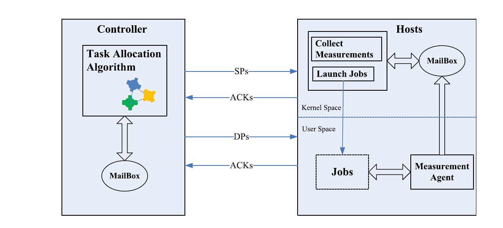
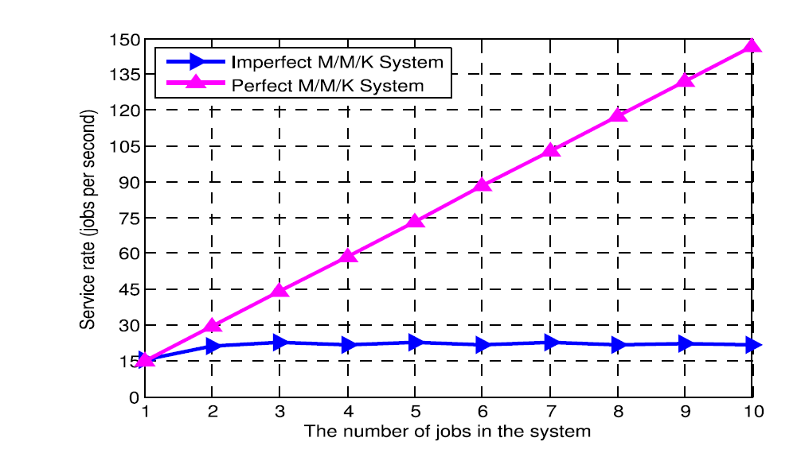
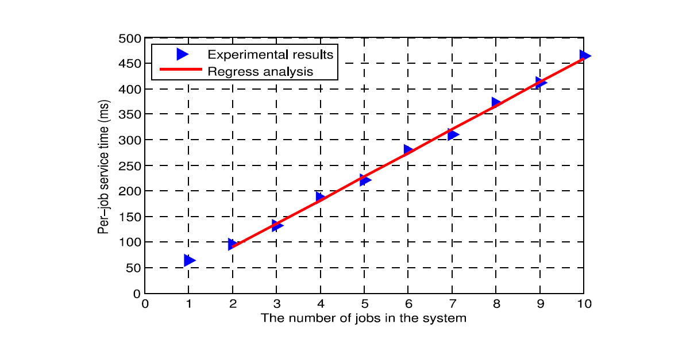
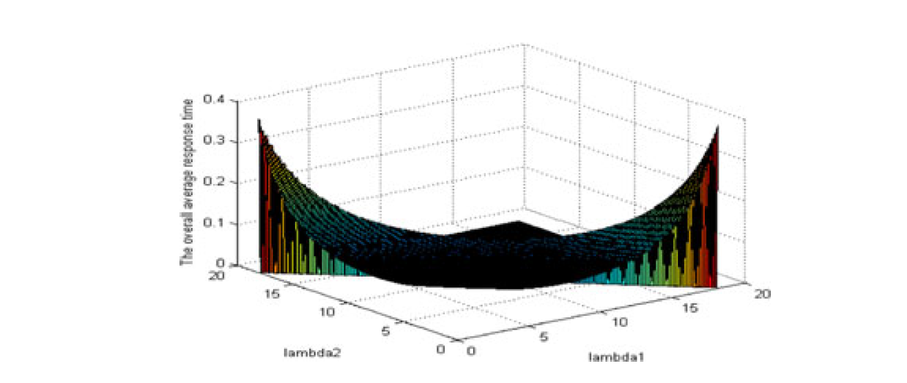
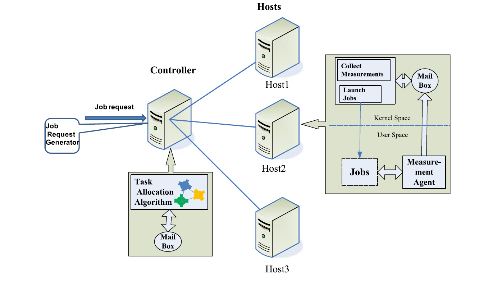
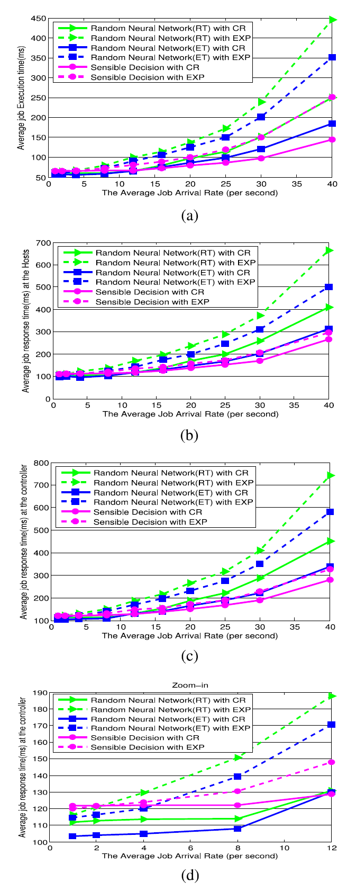
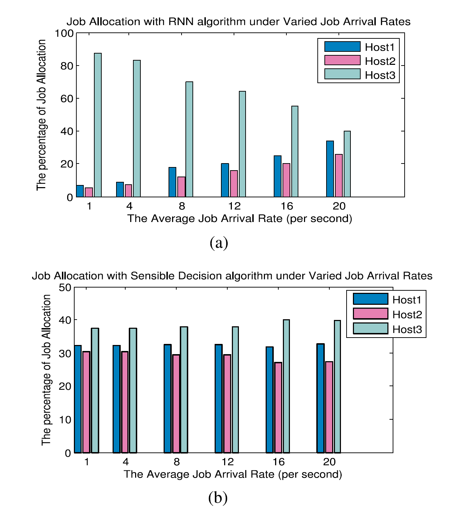
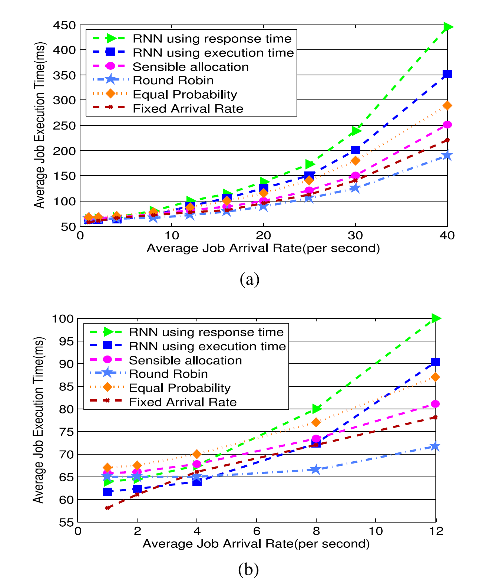
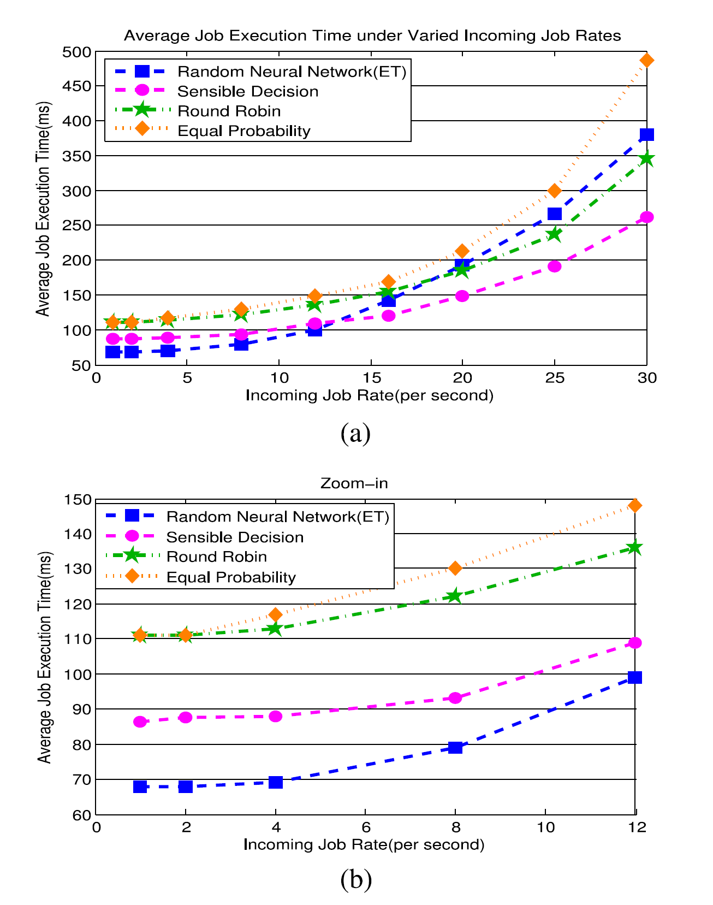
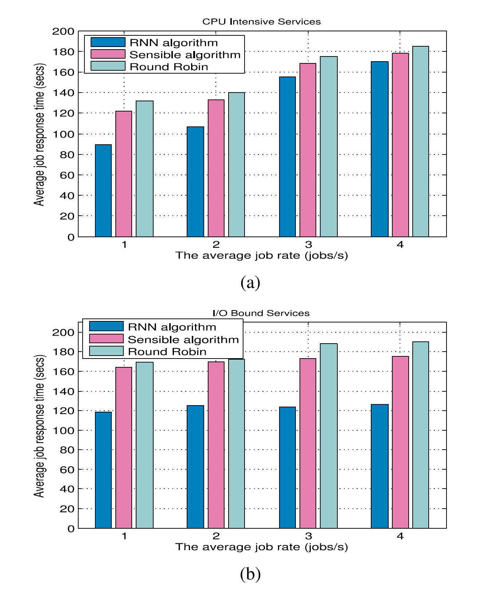

# Adaptive Dispatching of Tasks in the Cloud

> Abstract—The increasingly wide application of Cloud Computing enables the consolidation of tens of thousands of applications in shared infrastructures. Thus, meeting the QoS requirements of so many diverse applications in such shared resource environments has become a real challenge, especially since the characteristics and workload of applications differ widely and may change over time. This paper presents an experimental system that can exploit a variety of online QoS aware adaptive task allocation schemes, and three such schemes are designed and compared. These are a measurement driven algorithm that uses reinforcement learning, secondly a “sensible” allocation algorithm that assigns tasks to sub-systems that are observed to provide a lower response time, and then an algorithm that splits the task arrival stream into sub-streams at rates computed from the hosts’ processing capabilities. All of these schemes are compared via measurements among themselves and with a simple round-robin scheduler, on two experimental test-beds with homogenous and heterogenous hosts having different processing capacities.
>
> Index Terms—Cognitive packet network, random neural network, reinforcement learning, sensible decision algorithm, task allocation, cloud computing, task scheduling, Round Robin

摘要 — 云计算的应用越来越广泛，可以在共享基础架构中整合数万个应用程序。因此，满足这种共享资源环境中的许多不同应用的QoS要求已成为真正的挑战，尤其是因为应用的特性和工作量差异很大并且可能随时间而变化。本文提出了一种可以利用各种在线QoS感知自适应任务分配方案的实验系统，设计并比较了三种这样的方案。这些是使用强化学习的测量驱动算法，其次是“敏感”分配算法，其将任务分配给被观察以提供较低响应时间的子系统，然后是将任务到达流分成子流的算法。根据主机的处理能力计算的费率。所有这些方案通过它们之间的测量和简单的轮转调度器在具有不同处理能力的同质和异质主体的两个实验测试台上进行比较。

索引项 - 认知分组网络，随机神经网络，强化学习，敏感决策算法，任务分配，云计算，任务调度，轮转

## 1 INTRODUCTION

> CLOUD computing enables elasticity and scalability of computing resources such as networks, servers, storage, applications, and services, which constitute a shared pool, providing on-demand services at the level of infrastructure, platform and software [1]. This makes it realistic to deliver computing services in a manner similar to utilities such as water and electricity where service providers take the responsibility of constructing IT infrastructure and endusers make use of the services through the Internet in a payasyou-go manner. This convenient and cost-effective way of access to services boosts the application of Cloud computing, which spans many domains including scientific, health care, government, banking, social networks, and commerce [2].
>
> An increasing number of applications from the general public or enterprise users are running in the Cloud, generating a diverse set of workloads in terms of resource demands, performance requirements and task execution [3]. For example, multi-tier web applications composed of several components which are commonly deployed on different nodes [4] impose varied stress on the respective node, and create interactions across components. Tasks being executed in a cloud environment may be of very different types, such as Web requests that demand fast response and produce loads that vary significantly over time [5], and scientific applications that are computation intensive and may undergo several phases with varied workload profiles [6], and MapReduce tasks can be composed of different tasks of various sizes and resource requirements [5]. Furthermore, Cloud Computing enables highly heterogeneous workloads to be served on a shared IT infrastructure leading to inevitable interference between co-located workloads [7], while end users require assurance of the quality and reliability of the execution of the tasks that they submit. Therefore, the cloud service provider must dispatch incoming tasks to servers with consideration for the quality of service (QoS) and cost within a diverse and complex workload environment. Also, energy consumption remains a major issue that can be mitigated through judicious energy-aware scheduling [8].
>
> Thus the present paper focuses primarily on designing and evaluating adaptive schemes that exploit on-line measurement and take decisions with low computational overhead for fast on-line decision making. This work can be relevant to Cloud service providers that use the SaaS model where customers pay for the services, while the service provider sets up the VMs where the required software components are installed to deal with the service requests from the customer.
>
> Our experimental evaluations are conducted on a multiple host test-bed, running with low to high loads that are achieved by varying the types and arrival rates of tasks. To conduct these experiments with greater ease, we have also designed and implemented a portable software module, the Task Allocation Platform (TAP), that is Linux based and easily installed on a Linux based machine. TAP will dynamically allocate user tasks to the available machines, with or without making use of on-line measurements of the resulting performance, and adapt to changes in workload and on-going performance of the Cloud environment, while optimising goals such as cloud provider’s profit while maintaining service level agreements (SLAs). TAP is flexible in that it can easily support distinct static or dynamic allocation schemes. It collects measurements on the test-bed, both to report on performance evaluation and also (for certain allocation algorithms) to exploit measurements for adaptive decisions.
>
> Thus in this paper we will report on the performance observed with two well known static allocation algorithms (Round-Robin and a probabilistic “equal loading” scheme), and three dynamic algorithms that are described in Section 3.1.

云计算可实现计算资源（如网络，服务器，存储，应用程序和服务）的弹性和可扩展性，这些资源构成共享池，在基础架构，平台和软件级别提供按需服务[1]。这使得以类似于水和电等公用事业的方式提供计算服务变得切合实际，其中服务提供商负责构建IT基础设施并且最终用户以付费方式通过因特网利用服务。这种方便且经济高效的服务访问方式促进了云计算的应用，云计算涵盖了许多领域，包括科学，医疗保健，政府，银行，社交网络和商业[2]。

来自普通公众或企业用户的越来越多的应用程序正在云中运行，在资源需求，性能要求和任务执行方面产生了各种各样的工作负载[3]。例如，由通常部署在不同节点上的若干组件组成的多层Web应用程序[4]对各个节点施加不同的压力，并在组件之间创建交互。在云环境中执行的任务可能是非常不同的类型，例如需要快速响应并产生随时间变化很大的负载的Web请求[5]，以及计算密集型且可能经历具有不同工作负载配置文件的多个阶段的科学应用程序[6]，MapReduce任务可以由不同大小和资源要求的不同任务组成[5]。此外，云计算可以在共享的IT基础架构上提供高度异构的工作负载，从而导致共址工作负载之间不可避免的干扰[7]，而最终用户需要确保他们提交的任务执行的质量和可靠性。因此，云服务提供商必须在不同且复杂的工作负载环境中考虑服务质量（QoS）和成本，将传入任务分派给服务器。此外，能源消耗仍然是一个主要问题，可以通过明智的能源感知调度来减轻[8]。

因此，本文主要侧重于设计和评估利用在线测量的自适应方案，并以较低的计算开销做出决策，以实现快速的在线决策。此工作可以与使用SaaS模型的云服务提供商相关，客户为服务付费，而服务提供商则设置安装了所需软件组件的VM，以处理来自客户的服务请求。

我们的实验评估是在多个主机试验台上进行的，通过改变任务的类型和到达率来实现低负荷到高负荷。为了更轻松地进行这些实验，我们还设计并实现了一个便携式软件模块，即任务分配平台（TAP），它基于Linux并可轻松安装在基于Linux的机器上。TAP将动态地将用户任务分配给可用的计算机，无论是否使用对结果性能的在线测量，并适应云环境的工作负载和持续性能的变化，同时优化云提供商的利润等目标同时维护服务水平协议（SLA）。TAP非常灵活，因为它可以轻松支持不同的静态或动态分配方案。它在测试台上收集测量结果，既可以报告性能评估，也可以（针对某些分配算法）利用测量结果进行自适应决策。

因此，在本文中，我们将报告使用两种众所周知的静态分配算法（Round-Robin和概率“等加载”方案）观察到的性能，以及3.1节中描述的三种动态算法。

## 2 PRIOR WORK

> Extensive research in this challenging area includes work on static algorithms [9], [10], [11] which are simple without excessive overhead; but they are only suitable for stable environments, and cannot easily adapt to dynamic changes in the cloud. Dynamic algorithms [12], [13], [14], [15] take into consideration different application characteristics and workload profiles both prior to, and during, run-time; however their complexity can result in computational overhead that may cause performance degradation when implemented in a real system. Thus, many dynamic and adaptive schemes have only been evaluated through simulations [16] rather than in practical experiments, while few have been tested in real environments but with low task arrival rates [3].
>
> Much work on task assignment in the cloud is based on a detailed representation of tasks to be executed with a rather simplistic representation of the hosts or processing sub-systems, leading to an evaluation based on simulation experiments rather than measurements on a real system. In [17] an application composed of many tasks is represented by a directed acyclic graph (DAG) where tasks, inter-task dependency, computation cost, and inter-task communication cost are represented; two performance-effective and lowcomplexity algorithms rank the tasks to assign them to a processor in a heterogeneous environment. Related work is presented in [18], [19], while optimisation algorithms based on genetic algorithms [20], ant colony optimisation (ACO) [21], Particle Swarm optimisation [22], Random Neural Network (RNN) optimisation [23], and auction-based mechanisms [24] have also been studied in this context, with potential applications to workload scheduling in the cloud [25]. In [26], workload models which reflect the diversity of users and tasks in a cloud production environment are obtained from a large number of tasks and users over a one month period, and exploited for evaluation in a simulated CloudSim framework.
>
> Other work has used experiments on real test-beds rather than simulations [5] where the characteristics of the typical heterogeneous workloads: parallel batch tasks, web servers, search engines, and MapReduce tasks, result in resource provisioning in a manner that reduces costs for the cloud itself. Another cost-effective resource provisioning system dedicated to MapReduce tasks [27] uses global resource optimisation. Hardware platform heterogeneity and co-scheduled workload interference are highlighted in [3], where robust analytical methods and collaborative filtering techniques are used to classify incoming workloads in terms of heterogeneity and interference before being greedily scheduled in a manner that achieves interference minimisation and server utilization maximization. The system is evaluated with a wide range of workload scenarios on both a small scale computer cluster and a large-scale Cloud environment applying Amazon EC2 to show its scalability and low computation overhead. However, the arrival rate of incoming workload is low and thus the system performance under saturation state is not examined. Furthermore, the contention for processor cache, memory controller and memory bus incurred by collocated workloads are studied in [28].
>
> Early research that considers the important role of servers in delivering QoS in the Internet can be found in [29], where an architecture is proposed which provides web request classification, admission control, and scheduling with several priority policies to support distinct QoS requirements for different classes of users formulti-tierweb applications. However, the scheduling approach is static and in [4], an adaptive feed-back driven resource control system is developed to dynamically provision resource sharing for multi-tier applications in order to achieve both high resource utilization and application-level QoS. A two-tiered on-demand resource allocation mechanism is presented in [30] with local allocation within a server and global allocation based on each local one, so as to achieve better resource utilization and dynamically adjust according to time-varying capacity demands. Energy consumption in computation, data storage and communications is also a challenge in the cloud. A model for server performance and power consumption is derived in [31] with the potential to predict power usage in terms of workload intensity. In [8], the authors examine the selection of system load that provides the best trade-off between energy consumption and QoS.A heterogeneity-aware dynamic capacity provisioning scheme for cloud data centers is proposed in [32], which classifies workloads based on the heterogeneity of both workload and machine hardware and dynamically adjusts the number of machines so as to optimise overall energy consumption and scheduling delay.

在这个具有挑战性的领域进行了广泛的研究，包括静态算法[9]，[10]，[11]的工作，这些算法很简单，没有过多的开销;但它们只适用于稳定的环境，并且不能轻易适应云中的动态变化。动态算法[12]，[13]，[14]，[15]在运行时之前和期间考虑了不同的应用程序特征和工作负载配置文件;然而，它们的复杂性可能导致计算开销，当在实际系统中实现时可能导致性能下降。因此，许多动态和自适应方案仅通过模拟[16]而不是在实际实验中进行评估，而很少有在真实环境中进行测试，但任务到达率较低[3]。

云中任务分配的大量工作是基于对主机或处理子系统的相当简单的表示来执行的任务的详细表示，从而导致基于模拟实验而不是在真实系统上的测量的评估。在[17]中，由许多任务组成的应用程序由有向无环图（DAG）表示，其中表示任务，任务间依赖性，计算成本和任务间通信成本;两个性能有效和低复杂度算法对任务进行排序，以将它们分配给异构环境中的处理器。相关工作见[18]，[19]，而优化算法基于遗传算法[20]，蚁群优化（ACO）[21]，粒子群优化[22]，随机神经网络（RNN）优化[23]基于拍卖的机制[24]也在此背景下进行了研究，可能会在云中应用于工作负载调度[25]。在[26]中，反映云生产环境中用户和任务的多样性的工作负载模型是在一个月的时间内从大量任务和用户获得的，并在模拟的CloudSim框架中用于评估。

其他工作在实际测试平台上使用实验而不是模拟[5]，其中典型的异构工作负载的特征：并行批处理任务，Web服务器，搜索引擎和MapReduce任务，导致资源配置以降低成本云本身。另一个专门用于MapReduce任务的经济高效的资源配置系统[27]使用全局资源优化。[3]强调了硬件平台的异构性和共同调度的工作负载干扰，其中使用强大的分析方法和协同过滤技术，在以实现干扰最小化和服务器利用率的方式进行贪婪调度之前，根据异构性和干扰对传入工作负载进行分类最大化。在小规模计算机集群和应用Amazon EC2的大规模云环境中，使用各种工作负载方案评估系统，以显示其可扩展性和低计算开销。但是，进入工作负载的到达率较低，因此不检查饱和状态下的系统性能。此外，在[28]中研究了由并置工作负载引起的处理器高速缓存，存储器控制器和存储器总线的争用。

考虑服务器在互联网上提供QoS的重要作用的早期研究可以在[29]中找到，其中提出了一种体系结构，该体系结构提供Web请求分类，准入控制和具有若干优先级策略的调度，以支持不同的QoS要求。用户类构成multi-tierweb应用程序。然而，调度方法是静态的，并且在[4]中，开发了自适应反馈驱动资源控制系统以动态地为多层应用提供资源共享，以实现高资源利用率和应用级QoS。在[30]中提出了一种双层按需资源分配机制，其中服务器内的本地分配和基于每个本地分配的全局分配，以便实现更好的资源利用并根据时变容量需求动态调整。计算，数据存储和通信中的能耗也是云中的挑战。在[31]中推导出服务器性能和功耗的模型，可以根据工作负载强度预测功耗。在[8]中，作者研究了系统负载的选择，它提供了能量消耗和QoS之间的最佳平衡。在[32]中提出了一种用于云数据中心的异构性感知动态容量配置方案，该方案基于以下方式对工作负载进行分类。工作负载和机器硬件的异构性，动态调整机器数量，以优化整体能耗和调度延迟。

## 3 OVERVIEW OF THIS PAPER

> The present paper uses experiments to investigate adaptive dynamic allocation algorithms that take decisions based on on-line and up-to-date measurements, and make fast online decisions to achieve desirable QoS levels [33]. The TAP that we have designed to this effect is a practical system implemented as a Linux kernel module which can be easily installed and loaded on any PC with the Linux OS. 
>
> TAP runs on a given host, and embeds measurement agents into each host in a cloud to observe the system’s state. These observations are then collected by “smart packets” (SPs) that TAP sends at regular intervals into the system in a manner which favours the search of those sub-systems which are of the greatest interest because they may be used more frequently or because they could provide better performance. The remainder of the paper is organized as follows.
>
> The task allocation algorithms, including three novel approaches, are discussed in Section 3.1. TAP, the task allocation platform that we have designed, is discussed in Section 4, where the dynamic algorithms are introduced. Section 4.1 discusses all the three measurement based allocation schemes, including a mathematical model based scheme presented in Section 4.1.1, the Sensible Algorithm in Section 4.1.2, and the scheme that uses the RNN with reinforcement learning (RL) in Section 5.
>
> The experimental results are introduced in Section 6, and first comparison of the different allocation schemes is presented in Section 7. In Section 7.2 we present further experimental results when the hosts being used have distinctly different processing speeds.
>
> In Section 8 we introduce a “contradictory” performance metric based on the economic cost, as perceived by the cloud platform, of executing tasks: this cost includes the penalty that the cloud would have to pay to the end user when a SLA is violated, as well as the intrinsic economic cost of using faster or slower hosts. This same cost function is used for task allocation in view of minimising the overall cost to the cloud service, and it is then measured and reported for both the Sensible and the RNN based algorithms.
>
> Finally, Section 9 draws our main conclusions and discusses directions for future research.

本文使用实验来研究自适应动态分配算法，该算法基于在线和最新测量做出决策，并做出快速在线决策以达到理想的QoS水平[33]。我们为此设计的TAP是一个实现为Linux内核模块的实用系统，可以通过Linux操作系统轻松安装和加载到任何PC上。

TAP在给定主机上运行，并将测量代理嵌入到云中的每个主机中以观察系统的状态。然后通过“智能数据包”（SP）收集这些观察结果，TAP定期以有利于搜索那些最感兴趣的子系统的方式发送到系统中，因为它们可能更频繁地使用或者因为它们可以提供更好的表现。在本文的其余部分安排如下。

任务分配算法，包括三种新方法，将在3.1节中讨论。我们设计的任务分配平台TAP将在第4节中讨论，其中引入了动态算法。4.1节讨论了所有三种基于测量的分配方案，包括4.1.1节中介绍的基于数学模型的方案，4.1.2节中的敏感算法，以及第5节中使用RNN和强化学习（RL）的方案。

实验结果在第6节中介绍，不同分配方案的第一次比较在第7节中给出。在7.2节中，当使用的主机具有明显不同的处理速度时，我们提供了进一步的实验结果。

在第8节中，我们根据云平台所感知的执行任务的经济成本引入了一个“矛盾”的绩效指标：这个成本包括当违反SLA时云必须支付给最终用户的代价，以及使用更快或更慢主机的内在经济成本。考虑到最小化云服务的总成本，该相同的成本函数用于任务分配，然后针对基于感知和基于RNN的算法测量和报告该成本函数。

最后，第9节得出了我们的主要结论，并讨论了未来研究的方向。

### 3.1 The Task Allocation Algorithms that Are Investigated

> In this paper we design, implement in TAP and then experiment with several allocation algorithms:
>
> a) round robin allocation of incoming tasks to distinct hosts,
>
> b) a scheme that simply dispatches tasks with equal probability among hosts,
>
> c) an allocation scheme that uses measurements of the execution times (ETs) of tasks at hosts to allocate tasks probabilistically, where the probabilities are chosen via a mathematical model prediction so as to *minimise the average response time (RT)* for all tasks,
>
> d) a Random Neural Network (RNN) [34], [35] based scheme that uses reinforcement learning with a numerically defined goal function that is updated with measurements brought back to TAP by SPs, and
>
> e) an on-line greedy adaptive algorithm we call “sensible routing” [36] that selects probabilistically the host whose measured QoS is the best.
>
> To the best of our knowledge, the approaches (d) and (e) have not been used before for task allocation in Cloud or other multi-server environments, though related ideas were suggested for selecting packet routes in multi-hop packet networks [37]. On the other hand, (a) and (b) are well known algorithms that are useful as benchmarks, and a scheme similar to (c) has been proposed in [8] for implementing trade-offs between energy consumption and quality-of-service in multiple-server computer systems.
>
> We evaluate these schemes under varied task arrival rate via experiments on two test-beds: a cluster composed of hosts with similar processing speeds, and another one with where the hosts have significantly distinct processing capacities. The experimental results are then analysed and reported.

在本文中，我们在TAP中设计，实现，然后尝试几种分配算法：

a）循环分配传入任务到不同的主机，

b）一种简单地在主机之间以相同的概率发送任务的方案，

c）分配方案，其使用主机上的任务的执行时间（ET）的测量来概率地分配任务，其中通过数学模型预测来选择概率，以便*最小化所有任务的平均响应时间*（RT），

d）基于随机神经网络（RNN）[34]，[35]的方案，其使用具有数字定义的目标函数的强化学习，其通过由SP返回到TAP的测量来更新，以及

e）我们称之为“合理路由”的在线贪婪自适应算法[36]，其概率地选择其测量的QoS最佳的主机。

据我们所知，方法（d）和（e）之前尚未用于云或其他多服务器环境中的任务分配，尽管建议在多跳分组网络中选择分组路由[37]]。另一方面，（a）和（b）是众所周知的算法，可用作基准，并且在[8]中提出了类似于（c）的方案，用于实现能量消耗和质量之间的权衡与多服务器计算机系统中的服务。

我们通过在两个试验台上进行实验，在不同任务到达率下评估这些方案：由具有相似处理速度的主机组成的集群，以及另一个具有显着不同处理能力的主机。然后分析和报告实验结果。

## 4 TASK ALLOCATION PLATFORM AND TEST-BED

> TAP carries out online monitoring and measurement constantly in order to keep track of the state of the Cloud system, including resource utilisation (CPU, memory, and I/O), system load, application-level QoS requirements, such as task response time and bandwidth, as well as energy consumption, and possibly also (in future versions of TAP) system security and economic cost. With knowledge learned from these observations, the system can employ the QoS driven task allocation algorithms that we have designed, to make online decisions to achieve the best possible QoS as specified by the tasks’ owners, while adapting to conditions that vary over time.
>
> Fig. 1 shows TAP’s building blocks. The controller, which is the intellectual center of the system, accommodates the online task allocation algorithms, which work alongside the learning algorithm, with the potential to adaptively optimise the use of the cloud infrastructure. TAP penetrates into the cloud infrastructure by deploying measurement agents to conduct online observations that are relevant to the QoS requirements of end users, and send back the measurements to the controller. Three types of packets are used [37] for communications between the components of the system: smart packets for discovery and measurement, dumb packets (DPs) for carrying task requests or tasks, and acknowledgement packets (ACKs) that carry back the information that has been discovered by SPs. In this section, we present in detail the mechanisms that are implemented in the platform and the algorithms that are used.
>
> SPs are first sent at random to the various hosts in order to obtain some initial information and inform the measurement agents in the hosts to activate the requested measurement. The task allocation algorithm in TAP learns from the information carried back by the ACKs and makes adaptively optimised decisions which are used to direct the subsequent SPs. Thus, the SPs collect online measurements in an efficient manner and pay more attention to the part of the cloud where better QoS can be offered, visiting the worse performing parts less frequently.
>
> The incoming tasks or task requests are encapsulated into the DPs, and exploit the decisions explored by SPs to select the host/Cloud sub-system that will execute the task. Once a task (request) arrives at a host in the cloud, its monitoring is started by the measurement agent which records the trace of the task execution until it is completed and deposits the records into a mailbox which is located in the kernel memory of the host. When an SP arrives at this host, it collects the measurements in the mailbox and generates an ACK which carries the measurements, and travels back to the controller where the measurement data is extracted and used for subsequent decisions of the task allocation algorithm. As soon as a task completes its execution, the agent also produces an ACK heading back to the controller with all the recorded data, such as the task arrival time at the Cloud, the time at which the task started running and the time at which the task execution completed. When the ACK of the DP reaches the controller, the task response time at the controller is estimated by taking the difference between the current arrival time at the node and the time at which the corresponding task arrives at the controller which is used by the algorithm when the task response time is required to be minimised.

TAP不断进行在线监控和测量，以跟踪云系统的状态，包括资源利用率（CPU，内存和I / O），系统负载，应用级QoS要求，如任务响应时间和带宽，以及能源消耗，也可能（在未来版本的TAP中）系统安全性和经济成本。利用从这些观察中获得的知识，系统可以采用我们设计的QoS驱动的任务分配算法，以做出在线决策，以实现任务所有者指定的最佳QoS，同时适应随时间变化的条件。

图1显示了TAP的构建块。作为系统智能中心的控制器适应在线任务分配算法，该算法与学习算法一起工作，具有自适应优化云基础设施使用的潜力。TAP通过部署测量代理来进入云基础架构，以进行与最终用户的QoS要求相关的在线观察，并将测量结果发送回控制器。系统组件之间的通信使用了三种类型的数据包[37]：用于发现和测量的智能数据包，用于承载任务请求或任务的哑数据包（DP），以及用于传回信息的确认数据包（ACK）被SP发现。在本节中，我们将详细介绍平台中实现的机制以及所使用的算法。

首先将SP随机发送到各个主机以获得一些初始信息并通知主机中的测量代理以激活所请求的测量。TAP中的任务分配算法从ACK携带的信息中学习，并做出自适应优化的决策，用于指导后续SP。因此，SP以有效的方式收集在线测量并且更多地关注可以提供更好的QoS的云的部分，更少地访问性能较差的部分。

传入的任务或任务请求被封装到DP中，并利用SP探索的决策来选择将执行任务的主机/云子系统。一旦任务（请求）到达云中的主机，其监视就由测量代理启动，该代理记录任务执行的跟踪直到完成，并将记录存入位于内核内存中的邮箱。主办。当SP到达该主机时，它收集邮箱中的测量值并生成携带测量值的ACK，并返回到提取测量数据的控制器，并用于后续任务分配算法的决定。一旦任务完成其执行，代理还会生成一个ACK，并返回控制器并记录所有记录的数据，例如云上的任务到达时间，任务开始运行的时间以及任务开始运行的时间。任务执行完成。当DP的ACK到达控制器时，通过获取节点处的当前到达时间与相应任务到达控制器的时间之间的差值来估计控制器处的任务响应时间，该控制器在算法使用时任务响应时间需要最小化。

*图1.显示任务分配平台的系统架构，该平台由接收和分派作业的特定计算机托管，并与安装在执行作业的每台主机上的测量系统（右侧）交互。TAP使用 SP，DP和 ACK与主机上的每个测量系统进行通信，如文中所示。*

### 4.1 Probabilistic Task Allocation Schemes

> The schemes (b), (c), and (e) described in Section 3.1 are examples of probabilistic task allocation schemes. In these schemes, when a task arrives from some user or source outside the Cloud system, TAP decides to allocate it to some host i among the N possible hosts with probability pi so that at decision time when the task must be allocated:
>
> - TAP first calculates $p_i$ for each of the hosts $i$, 
> - Then TAP uses these probabilities to actually select the host that will receive the task.
>
> In the case of (b) we obviously have $p_i=1/N$.
>
> Probabilistic schemes have the advantage that a host which is being preferred because, say it is providing better service, is not systematically overloaded by repeated allocation since the QoS it offers is only used probabilistically to make a task allocation. In other words, the chance that a given server receives two successive tasks is very small as compared to the case where successive tasks are allocated to distinct servers.
>
> In addition to (b), we experiment with two distinct schemes to calculate $p_i$, Model Based Allocation (c) and Sensible Routing (e).

第3.1节中描述的方案（b），（c）和（e）是概率任务分配方案的示例。在这些方案中，当任务从云系统外部的某个用户或来源到达时，TAP决定以概率$p_i$将其分配给$N$个可能主机中的某个主机$i$，以便在决策时必须分配任务：

- TAP首先为每个主机$i$计算$p_i$，

- 然后TAP使用这些概率来实际选择将接收任务的主机。

在（b）的情况下，我们显然有$p_i=1/N$.

概率方案的优点在于，能提供更好的服务而被优选的主机不会被重复分配，从而导致系统过载，因为它提供的QoS仅在概率上用于进行任务分配。换句话说，与将连续任务分配给不同服务器的情况相比，给定服务器接收两个连续任务的机会非常小。

除了（b）之外，我们还尝试了两种不同的方案来计算 $p_i$，基于模型的分配（c）和合理路由（e）。

#### 4.1.1 Model Based Task Allocation

> Model Based Allocation (c) uses a mathematical model to predict the estimated performance at a host in order to make a randomised task allocation. This has been used in earlier work concerning task allocation schemes that help reduce the overall energy consumed in a system [8]. In this approach, if $W_{i}\left(\lambda, p_{i}\right)$  is the relevant QoS metric obtained for host $i$ by allocating a randomised fraction $p_i$ of tasks to host $i$ when the overall arrival rate of tasks to TAP is $\lambda$, then the allocation probabilities $p_1,..., p_N$ are chosen so as to minimise the overall average QoS metric:
> $$
> W=\sum_{i=1}^{N} p_{i} W_{i}\left(\lambda, p_{i}\right)
> $$
>
> At first glance, since each host $i$ is a multiple-core machine with $C_i$ cores, a simple mathematical model that can be used to compute, say the QoS metric “response time” $W_{i}\left(\lambda, p_{i}\right)$ that host $i$ provides, assuming that there are no main memory limitations and no interference among processors (for instance for memory or disk access), is the $M/M/C_i$ queueing model [38], i.e. with Poisson arrivals, exponential service times, and $C_i$ servers. Of course, both the Poisson arrival and the exponential service time assumptions are simplifications of reality, and more detailed and precise models are also possible for instance using diffusion approximations [39] but would require greater computational effort and more measurement data.
>
> However, a set of simple experiments we have conducted show that the $M/M/K$ model for each host would not correspond to reality. Indeed, in Fig. 2 we report the measured completion rate of tasks on a host (y-axis) relative to the execution time for a single task running by itself, as a function of the number of simultaneously running tasks (x-axis). These measurements were conducted on a single host (Host 1), and for a single task running on the system, the average task processing time was 64.1 ms.

基于模型的分配（c）使用数学模型来预测主机的估计性能，以便进行随机任务分配。这已经用于早期有关任务分配方案的工作中，这有助于减少系统中的总能量消耗[8]。在这种方法中，通过将任意的随机分数为$p_i$的任务分配给主机$ i $，到TAP的总体任务到达率是$ \lambda $，如果$W_{i}\left(\lambda, p_{i}\right)$是主机$ i $获得的相关QoS度量，则选择分配概率$ p_1，...，p_N $以便最小化整体平均QoS度量：

$$
W=\sum_{i=1}^{N} p_{i} W_{i}\left(\lambda, p_{i}\right)
$$

乍一看，由于每台主机$ i $都是一台带有$ C_i $个核心的多核机器，这是一个可以用来计算的简单数学模型，比如主机$ i $提供了QoS指标"响应时间"$ W_ {i} \left(\lambda，p_ {i} \right)$，假设没有主存限制且处理器之间没有干扰（例如内存或磁盘访问），是$ M / M / C_i $排队模型[38]，即Poisson到达，指数服务时间和$ C_i $个服务器。当然，泊松到达和指数服务时间假设都是现实的简化，例如使用扩散近似[39]也可能有更详细和精确的模型，但需要更多的计算工作量和更多的测量数据。

然而，我们进行的一系列简单实验表明，每个主机的$ M / M / K $模型与现实不符。实际上，在图2中，我们报告了主机上任务的测量完成率（y轴）相对于自身运行的单个任务的执行时间，作为同时运行的任务数量（x轴）的函数。这些测量在单个主机（主机1）上进行，对于在系统上运行的单个任务，平均任务处理时间为64.1毫秒。

*图 2.完美多核系统（红色）提供的理想服务率，与主机1（蓝色）上测量的任务完成率相比，与主机上同时运行的任务数（x轴）绘制。*

> If this were a perfectly running ideal parallel processing system, we could observe something close to a linear increase in the completion rate of tasks (red dots) when the number of simultaneously running tasks increases, until the number of cores in the machine $C_1$ have been reached. However the measurements shown in Fig. 2 indicate (blue dots) a significant increase in completion rate as the number of tasks goes from 1 to 2, but then the rate remains constant, which reveals that there may be significant interference between tasks due to competition for resources. Indeed, if we call $\gamma\left(l\right)$ the average completion rate per task, we observed the following values for $\gamma_i\left( l \right) / \gamma_i\left( 1 \right)$ for $l = 2,...10$ computed to two decimal digits: 0.67, 0.48, 0.34,  0.29, 0.23, 0.20, 0.17, 0.15, 0.13. From this data, a linear regression estimate was then computed for the average execution time $\mu(i)^{-1}$ when there are $l$ tasks running simultaneously, as shown on Fig. 3, yielding a quasi-linear increase. As a result we can quite accurately use the estimate $l . \gamma(l) / \gamma(1) \approx 1.386$. Based on this measured data, we model the distribution of the number of tasks in a host server $i$ as a random walk on the non-negative integers, where:

如果这是一个完美运行的理想并行处理系统，当同时运行的任务数量增加时，我们可以观察到任务完成率（红点）接近线性增加，直到机器中的$C_1$个核心数量已用完。然而，图2中所示的测量结果表明（蓝点）完成率随着任务数量从1增加到2而显着增加，但随后速率保持不变，这表明资源的竞争导致任务之间存在显著的干扰。实际上，如果我们称$\gamma\left(l\right)$是每个任务的平均完成率，我们会观察到根据公式 $\gamma_i\left( l \right) / \gamma_i\left( 1 \right)$ 计算的两位小数，其中$ l = 2，... 10 $：0.67,0.48,0.34,0.29,0.23,0.20,0.17,0.15,0.13。根据这些数据，当有$ l $个任务同时运行时，可以计算平均执行时间$\mu(i)^{-1}$的线性回归估计，如图3所示，产生准线性增加。因此，我们可以非常准确地使用估计$ l. \gamma(l) / \gamma(1) \approx 1.386 $。根据这些测量数据，我们对主机服务器$ i $中任务数量的分布进行建模，作为非负整数的随机游走，其中：

*图 3.主机1上每个任务的有效任务执行时间与主机上同时运行的任务数（x轴）的关系。*

> - $l=0$ represents the empty host (i.e. with zero tasks at the host), 
> - The transition rate from any state $l\ge0$ to state $l+1$ is the arrival rate of tasks to the host $\lambda_i$,
> - The transition rate from state 1 to state 0 is the $\mu_{i}(1)=T_{i}^{-1}$ where $T_i$ is the average execution time of a task (by itself) on the host,
> - The transition rate from state $l+1$ to state $l$ if $l\ge1$ is quasi constant given by $\mu_{i 0} \equiv(l . \gamma(l) / \gamma(1)) \mu_{i}(1)$ 
> - The arrival rate of tasks to Host $i$ is $\lambda_{i}=p_{i}^{m} \lambda$ where $p_{i}^{m}$ is the probability with which TAP using the model based algorithm assigns tasks to Host $i$, and $ \lambda $ is the overall arrival rate of tasks to TAP.
> 

- $l=0$代表空主机（即主机上没有任务）
- 对于任意状态$l\ge0$到状态$l+1$的转换率是主机$\lambda_i$的任务到达率
- 从状态1到状态0的转换率是$\mu_{i}(1)=T_{i}^{-1}$，其中$T_i$是在主机上任务(任务自身)的平均执行时间
- 从状态$l+1$到状态$l$的转换率是准常数，由$\mu_{i 0} \equiv(l . \gamma(l) / \gamma(1)) \mu_{i}(1)$ 给出

> The probability that there are $l$ tasks at Host $i$ in steady-state is then: 

在主机$i$上的$l$个任务稳定时的概率是

$$
\begin{aligned} p_{i}(1) &=p_{i}(0) \frac{\lambda_{i}}{\mu_{i}(1)}, p_{i}(l)=\left(\frac{\lambda_{i}}{\mu_{i 0}}\right)^{l-1} p_{i}(1), l>1 , \\ p_{i}(0) &=\frac{1-\frac{\lambda_{i}}{\mu_{i 0}}}{1+\lambda_{i} \frac{\mu_{i 0}-\mu_{i}(1)}{\mu_{i 0} \mu_{i}(1)}} \end{aligned}
$$
> Using Little’s formula [38] the overall average response times that we wish to minimise, by choosing the $p^m_i$ for a given $ \lambda $ is: 

我们希望最小化总体平均响应时间，通过对给定的$\lambda$选择$p_i^m$，使用 Little’s formula[38]：

$$
W^{m}=\sum_{i=1}^{N} \frac{p_{i}^{m}}{\mu_{i}(1)} \frac{p_{i}(0)}{\left(1-\frac{\lambda_{i}}{\mu_{i 0}}\right)^{2}}
$$
> The appropriate values of the $p^m_i$ for a given system and a given arrival rate $ \lambda $  can be then obtained numerically.
>
> To illustrate this approach for the specific service time data regarding the three hosts that we use, in Fig. 4 we show the variation of the average task response time with different combinations of $\left[\lambda_{1}, \lambda_{2}, \lambda_{3}\right]$, when $ \lambda=20\ task/sec $.

然后给定系统的$ p ^ m_i $和给定到达率$ \lambda $的合理值可以被量化地得到。

为了说明我们使用的三个主机的特定服务时间数据的这种方法，在图4中，我们展示了当$ \lambda=20\ task/sec $

时，不同组合$\left[\lambda_{1}, \lambda_{2}, \lambda_{3}\right]$的平均任务响应时间的变化。

#### 4.1.2 Sensible Routing

> The Sensible Decision Algorithm (e) uses a weighted average of $G_i$ of the goal function that we wish to minimise, which is estimated from on-going measurements at each host $i$, and updated each time $t$ that TAP receives a measurement that can be used to update the goal function. Specifically, when the goal function is the response time, its most recently measured value at time $t$, $G_i^t$ , is received at TAP for host $i$, and the $n$th update of $G_i$ is computed:
> $$
> G_{i} \leftarrow(1-\alpha) G_{i}+\alpha G_{i}^{t}
> $$
> where the parameter $0\le \alpha \le 1$ is used to vary the weight given to the most recent measurement as compared to past values. Based on updating this value for each host $i$, the probability $p_i^s$ that will be used to allocate a task to host $i$ is:
> $$
> p_{i}^{S}=\frac{\frac{1}{G_{i}}}{\sum_{j=1}^{N} \frac{1}{G_{j}}}, 1 \leq i \leq N
> $$
> If TAP allocates a task with this approach, it will use the most recent value of the $p^S_i$ which is available. Note that all of the $G_i$ values for different $i$ will not be equally “fresh”, though the probing via SPs from TAP to the hosts proceeds at the same rate for all the hosts.

敏感决策算法（e）使用我们希望最小化的目标函数的$G_i$的加权平均值，这是根据每个主机$ i $正在进行的测量估计的，并且在TAP收到的每个时刻$t$的测量可被用来更新目标函数。具体来说，当目标函数是响应时间时，在TAP为主机$ i $接收其最近测量的值$ t $，$ G_i ^ t $，第$ n $次更新的$ G_i $为：
$$
G_{i} \leftarrow(1-\alpha) G_{i}+\alpha G_{i}^{t}
$$
参数$0\le \alpha \le 1$被用于改变与旧值相比最近测量的权值。基于每个主机$i$更新的值，概率$p^S_i$被用于分配任务到主机$i$：

$$
p_{i}^{S}=\frac{\frac{1}{G_{i}}}{\sum_{j=1}^{N} \frac{1}{G_{j}}}, 1 \leq i \leq N
$$
如果TAP使用此方法分配任务，它将使用可用的$ p ^ S_i $的最新值。请注意，所有不同$ i $的$ G_i $值都不会同样“新鲜”，尽管通过SP从TAP到主机的探测对所有主机都以相同的速率进行。

-----

补充：

实际上，这里的思路即采用某次时刻$t$测量到的新值$G_i$（即主机$i$的某个参数的测量，文中举例为响应时间），去更新前几次的权重$G_i$，例如假设某主机$i$时刻$t=0$初始化$G_i=0$，时刻$t=1$测量到$G^{t=1}_i=100$，则更新$G_i=(1-\alpha)G_i+\alpha G_i^{t=1}$，如果$\alpha = 0.5$，则此时的$G_i=50$。

之后将测量的响应时间取倒数，即单位时间内主机$i$的响应速度，该公式可以看出，响应速度越快的主机拥有更高的概率被分配。

-----

## 5 RANDOM NEURAL NETWORK TASK ALLOCATION WITH REINFORCEMENT LEARNING

> The Random Neural Network has been used in static resource allocation as a “smart oracle” for allocating several resources to a set of tasks so as to minimise task execution times [35]. This earlier approach was based on first computing algorithmically a large set of optimum resource-to-task allocations, and then storing them in the RNN weights through a gradient descent learning algorithm. In order to select the best allocation, the trained RNN is then given an input which represents the set of available tasks, and it outputs the best known allocation.
>
> This earlier work differs completely from the approach used in this paper which is based on on-line search, similar to the search by autonomous robots [40], [41], [42] with reinforcement learning [43] with real-time measurements. The RNN has also been used for packet routing [44]; in that work, an RNN placed at each router to select the next hop for probe (or smart) packets which explore routes and collect quality of service information. Thus the probes are routed to explore the better paths in the network, and bring back the data they collect to each source router. End users then examine the data available at the source nodes, and select the best current paths from the data collected by the by the probes. This approach, where the RNNs serve to route the probes (but not the user traffic) also differs from the approach in this paper, where an RNN is used to decide, for a given task, which server should be used.
>
> In the present work, a RNN is used to select between $N$ hosts to which a task will be allocated, using its $N$ neurons in a fully connected form [23]. Each neuron $i$ is characterised by an integer $k_i(\tau) \ge 0$ which is its “level of excitation”, where $\tau$ represents time, and each neuron is connected to other neurons both via excitatory and inhibitory weights. Furthermore, for the specific application for TAP, each neuron is identified with a particular host, i.e. neuron $i$ is identified with the decision to assign a task to host $i$. The theoretical underpinning of the RNN [45] is a theorem that states that, at the equilibrium state, the probabilities:
> $$
> q_{i}=\lim _{\tau \rightarrow \infty} \operatorname{Prob}\left[k_{i}(\tau)>0\right]
> $$
> 

随机神经网络已经在静态资源分配中用作“智能oracle”，用于将多个资源分配给一组任务，以便最小化任务执行时间[35]。该早期方法基于首先在算法上计算一大组最佳资源到任务分配，然后通过梯度下降学习算法将它们存储在RNN权重中。为了选择最佳分配，训练的RNN然后被给予表示可用任务集的输入，并且它输出最佳已知分配。

这个早期的工作完全不同于本文中使用的基于在线搜索的方法，类似于自主机器人[40]，[41]，[42]的搜索和强化学习[43]与实时测量。RNN也被用于分组路由[44];在该工作中，RNN放置在每个路由器处以选择探测（或智能）分组的下一跳，其探索路由并收集服务质量信息。因此，探测器被路由以探索网络中更好的路径，并将它们收集的数据带回每个源路由器。然后，最终用户检查源节点上可用的数据，并从探针收集的数据中选择最佳当前路径。RNN用于路由探测器（但不是用户流量）的这种方法也不同于本文中的方法，其中RNN用于为给定任务决定应该使用哪个服务器。

在目前的工作中，RNN用于在完全连接的形式中使用其$ N $神经元在要分配任务的$ N $主机之间进行选择[23]。每个神经元$ i $的特征是整数$ k_i(\tau)\ge 0 $，这是它的“兴奋程度”，其中$ \tau $代表时间，每个神经元都通过兴奋和抑制连接到其他神经元权重。此外，对于TAP的特定应用，每个神经元都用特定主机识别，即神经元$ i $被识别为决定将任务分配给主机$ i $。RNN的理论基础[45]是一个定理，表明在均衡状态下，概率：

$$
q_{i}=\lim _{\tau \rightarrow \infty} \operatorname{Prob}\left[k_{i}(\tau)>0\right]
$$

> are uniquely obtained from the expression:
> $$
> q_{i}=\frac{\Lambda(i)+\sum_{j=1}^{N} q_{j} w^{+}(j, i)}{r(i)+\lambda(i)+\sum_{j=1}^{N} q_{j} w^{-}(j, i)}
> $$
> 

从表达式中唯一获得：
$$
q_{i}=\frac{\Lambda(i)+\sum_{j=1}^{N} q_{j} w^{+}(j, i)}{r(i)+\lambda(i)+\sum_{j=1}^{N} q_{j} w^{-}(j, i)}
$$

> where the $\omega^+(j,i)$ and $\omega^-(j,i)$ are the excitatory and inhibitory weights from neuron $j$ to neuron $i$ with $\omega^+(i,i)=\omega^-(i,i)=0$. $\Lambda(i)$ and $\lambda(i)$ are the inputs of external excitatory and inhibitory signals to neuron $i$, while:
> $$
> r(i)=\sum_{j=1}^{N}\left[w^{+}(i, j)+w^{-}(i, j)\right]
> $$
> In the present case, a distinct RNN is set up within TAP to cover each distinct goal function $G$. However, these different RNNs need not be created in advance and stored at TAP indefinitely, but instead created when they are actually needed. Thus we will have a distinct RNN that is used to decide about allocations made on the basis of minimising economic cost (as when the end users pay a monetary price for the work they receive), or minimising task response time, or minimising task execution time, and so on.

$\omega^+(j,i)$ 和 $\omega^-(j,i)$是从神经元$j$到神经元$i$的兴奋和抑制权重，其中 $\omega^+(i,i)=\omega^-(i,i)=0$。$\Lambda(i)$ 和 $\lambda(i)$ 是对神经元$i$的外部兴奋和抑制信号，其中
$$
r(i)=\sum_{j=1}^{N}\left[w^{+}(i, j)+w^{-}(i, j)\right]
$$
在当前情况下，在TAP内建立不同的RNN以覆盖每个不同的目标函数$G$。然而，这些不同的RNN不需要预先创建并且无限期地存储在TAP中，而是在实际需要时创建。因此，我们将有一个独特的RNN，用于决定在最小化经济成本的基础上进行的分配（如最终用户为他们收到的工作支付货币价格），或最小化任务响应时间，或最小化任务执行时间， 等等。

> A given RNN is initialised by setting $\omega^+(i,j)=\omega^-(i,j)=1/2(N-1)$, so that $r(i)=1$ for all $i$, and $\Lambda(i)=0.25+0.5\lambda(i)$. In particular we can choose $\lambda(i)=0$ so that all $\Lambda(i)=0.25$. This of course results in $q_i=0.5$ for all $i$.

一个给定的RNN通过设置$\omega^+(i,j)=\omega^-(i,j)=1/2(N-1)$初始化，所以对于所有的$i$，都有$r(i)=1$，并且$\Lambda(i)=0.25+0.5\lambda(i)$。特别的，我们可以选择$\lambda(i)=0$，那么$\Lambda(i)=0.25$。这当然会导致所有$i$的$q_i=0.5$。

> TAP will then use the $q_i$, $i=1,\dots,N$ to make allocations so that a task is assigned to the host $i$ that corresponds to the highest value of $q_i$. Initially, any one of the hosts will be chosen with equal probability. However with successive updates of the weights, this will change so that TAP selects the “better” hosts which provide a smaller value of $G$.
>
> When TAP receives a value $G^t_i$ of the goal function that was measured at time $t$ at host $i$, and $\frac{1}{G_i^t}$ is the “reward”, so that the RNN weights are updated as follows:

TAP然后会使用 $q_i$, $i=1,\dots,N$ 来分配，所以任务会被分配到对应的$q_i$值最大的主机$i$上。一开始，将以相同的概率选择任何一个主机。然而，随着权重的连续更新，这将被改变，以便TAP选择“更好”的主机，即$G$更小的那个。

当TAP收到目标函数$G_i^t$的值，即主机$i$在时刻$t$被测量的那个，并且$\frac{1}{G_i^t}$被当成“奖励”，以便RNN的权重如下进行更新：
$$
\begin{array}{l}{w^{+}(j, i) \leftarrow w^{+}(j, i)+\frac{1}{G_{i}^{t}}} \\ {w^{-}(j, k) \leftarrow w^{-}(j, k)+\frac{1}{G_{i}^{t}(N-2)}, \quad \text { if } k \neq i} \\ {\text { else if } G_{i}^{t}>T} \\ {w^{+}(j, k) \leftarrow ; w^{+}(j, k)+\frac{1}{G_{i}^{t}(N-2)}, \quad \text { if } k \neq i} \\ {w^{-}(j, i) \leftarrow w^{-}(i, j)+\frac{1}{G_{i}^{t}}}\end{array}
$$

> We compute $r^{*}(i)=\sum_{k=1}^{N}\left[w^{+}(i, k)+w^{-}(i, k)\right]$ for all $i$ and renormalise all weights so that their values do not grow indefinitely:
> $$
> w^{+}(i, k) \leftarrow \frac{r(i)}{r^{*}(i)} w^{+}(i, k), w^{-}(i, k) \leftarrow \frac{r(i)}{r^{*}(i)} w^{-}(i, k)
> $$
> 

我们计算所有主机$i$的$r^{*}(i)=\sum_{k=1}^{N}\left[w^{+}(i, k)+w^{-}(i, k)\right]$，以及重新规格化所有权值，保证他们的值不会无限增长：
$$
w^{+}(i, k) \leftarrow \frac{r(i)}{r^{*}(i)} w^{+}(i, k), w^{-}(i, k) \leftarrow \frac{r(i)}{r^{*}(i)} w^{-}(i, k)
$$

> After the weights are updated, the $q_i$ are computed using (6) with the new weights. Since this algorithm will tend to increase the probability $q_i$ of those neurons which correspond to hosts that yield a smaller value of $G_i$, each time TAP assigns a task to a host, it uses the host $i$ that corresponds to the largest $q_i$.
>
> In order to make sure that TAP tries out other alternates and does not miss out on better options, a fraction $f$ of the decisions are made in round robin fashion: thus we are sure that all hosts will be tried out in succession for$ f  \times 100%$ of the decisions, and the resulting goal function values will also be collected and updated. In the experiments that we describe below, $f$ was taken to be 0.1, i.e. 10 percent. We have actually evaluated this percentage experimentally and found 10 percent to provide the best value in the setting of our experiments, but depending on the size of the system this percentage may vary.
>
> Note also that this algorithm can be modified to a probabilistic “sensible” version [36] with:
> $$
> p_{i}^{R N N-S}=\frac{q_{i}}{\sum_{j=1}^{N} q_{j}}
> $$
> 

更新权重后，使用（6）的新权重计算$ q_i $。由于此算法倾向于增加$q_i$,$q_i$是与产生较小值$ G_i $的主机相对应的那些神经元的概率，每次TAP将任务分配给主机时，它使用对应主机$ i $最大的$ q_i $。

为了确保TAP尝试其他替代方案并且不会错过更好的选项，决策函数$f$使用循环方式设计：这样我们可以确保所有的主机会被连续试过以决定$f \times 100$，另外结果目标函数值会被收集和更新。在我们下面描述的实验中，$ f $被认为是0.1，即10％。我们实际上已经通过实验估计了这个百分比，发现10％可以在我们的实验设置中提供最佳值，但根据系统的大小，这个百分比可能会有所不同。

另请注意，此算法可以修改为概率“合理”版本[36]，如下：
$$
p_{i}^{R N N-S}=\frac{q_{i}}{\sum_{j=1}^{N} q_{j}}
$$

## 6 EXPERIMENTS

> We conduct our experiments on a hardware test-bed composed of four nodes that each offer computation, storage and I/O. One node is dedicated to supporting the decision algorithms implemented in TAP, and the other three nodes are used as hosts running task, as shown in Fig. 5, with each having a different processing power so that we may observe significant execution time differences for a given task. Since TAP takes decisions based on online measurements, even when there are no incoming tasks, the system maintains awareness of the state of the cloud by sending SPs periodically. End users are allowed to declare the QoS requirements related to the tasks they submit, which is then translated into one or more QoS metrics which constitute a function called the “goal function” in our system. In this way, the QoS requirements are transformed into a goal function to be minimised, e.g., the minimisation of the task response time. The goal function determines which system parameters need to be measured and how task allocation will be optimised. TAP is implemented as a Linux kernel module which can be easily installed and loaded on any PC with Linux OS. The three hosts (with 2.8, 2.4, and 3.0 GHz, respectively, dual-core CPU respectively) are used for task execution, while a separate host (2.8 GHz dual-core CPU) supports the controller.
>
> In these experiments we use a small scale test-bed so that we may easily load, and saturate, the system and evaluate the algorithms in both high, medium and low load conditions. However, TAP is scalable because most SPs are sent to to those hosts which are providing better performance, so that there is no “flooding” of SPs across the system. 
>
> A synthetic benchmark is generated with task profiles indicated by using the fields $\{task \  ID,QoS requirement, task Size\}$, which are packetised into an IP packet and sent to the controller. The task request generator uses this information to forward task requests to TAP. In order to vary the load, in addition to using tasks with distinct CPU and I/O needs, the average time between successive task initialisations is varied, and these times are either of fixed duration (denoted by CR in the figures), or follow a Poisson process denoted by $EXP$.

我们在由四个节点组成的硬件测试台上进行实验，每个节点提供计算，存储和I / O.一个节点专用于支持在TAP中实现的决策算法，其他三个节点用作运行任务的主机，如图5所示，每个节点具有不同的处理能力，因此我们可以观察到给定任务的重要的执行时间差异。由于TAP基于在线测量做出决策，即使没有传入任务，系统也会通过定期发送SP来保持对云状态的了解。允许最终用户声明与他们提交的任务相关的QoS要求，然后将其转换为一个或多个QoS度量，这些度量在我们的系统中构成称为“目标函数”的函数。以这种方式，QoS要求被转换成目标函数以被最小化，例如，最小化任务响应时间。目标函数确定需要测量哪些系统参数以及如何优化任务分配。TAP是作为Linux内核模块实现的，可以在任何具有Linux OS的PC上轻松安装和加载。三台主机（分别为2.8,2.4和3.0 GHz，分别为双核CPU）用于执行任务，而单独的主机（2.8 GHz双核CPU）则支持控制器。

在这些实验中，我们使用小型测试台，以便我们可以轻松地加载和饱和系统，并在高，中和低负载条件下评估算法。但是，TAP是可扩展的，因为大多数SP被发送到那些提供更好性能的主机，因此整个系统中没有“泛滥”SP。

生成合成基准，其中使用$ \{task \ ID，QoS requirements，task Size \} $字段指示任务配置文件，这些字段被分组到IP数据包中并发送到控制器。任务请求生成器使用此信息将任务请求转发到TAP。为了改变负载，除了使用具有不同CPU和I / O需求的任务之外，连续任务初始化之间的平均时间是变化的，并且这些时间是固定的持续时间（在图中用CR表示），或者遵循由$ EXP $表示的泊松过程。

*图5.任务分配试验台的示意图。作业到达控制器机器以分派给主机。TAP软件安装在控制器上并执行调度决策。TAP根据从每个执行作业的主机上安装的每个测量系统（右侧）收集的数据做出决策。*

> The first set of experiments we report were run with tasks that were defined as a “prime number generator with an upper bound B on the prime number being generated”. Thus the choice of B allowed us to vary both the execution time and the memory requirements of the task. We did not actually “transfer” the tasks from the task controller to the host, but rather installed the task in advance on the host, and the allocation decision by TAP just resulted in arrival of a message from TAP to activate the task with specific value of B on that particular host. The measurement agent resident on that host then monitored the task execution and recorded its measurements into the mailbox. Both the tasks and the measurement agent run in the user’s memory space, while the module that receives the SPs and task requests carried by DPs, collects measurements from the mailbox, and generates ACKs with the collected measurements runs in the kernel space of memory as shown in Fig. 5, so that interference between the user program and the system aspects are avoided at least within the memory.
>
> The two QoS goals that were considered were (i) the minimisation of either the execution time (denoted by ET in the figures) on the host, and (ii) the minimisation of the response time (denoted by RT in the figures) at TAP, where RT includes the message sent to activate the task at a host and the time it takes for an ACK to provide information back to TAP, where both the ET and the RT are provided to TAP from the host to the controller.
>
> We first used TAP with the RNN algorithm with Reinforcement Learning as described above, and TAP with the sensible decision algorithm, and compared their performance. The RNN based TAP was experimented with both (i) and (ii), whereas the sensible decision based TAP only used (ii) the task response time at the controller.

我们报告的第一组实验是使用被定义为“生成素数上限B的素数生成器”的任务运行的。因此，B的选择允许我们改变任务的执行时间和内存要求。我们实际上并没有将任务从任务控制器“转移”到主机，而是事先在主机上安装了任务，而TAP的分配决定只是从TAP到达了一条消息来激活具有特定值的任务B在那个特定的主人身上。驻留在该主机上的测量代理然后监视任务执行并将其测量记录到邮箱中。任务和测量代理都在用户的内存空间中运行，而接收SP的模块和DP携带的任务请求，从邮箱收集测量结果，并生成带有收集的测量结果的ACK，运行在内存的内核空间中，如图所示在图5中，至少在存储器内避免了用户程序和系统方面之间的干扰。

考虑的两个QoS目标是（i）在主机上最小化执行时间（在图中由ET表示），以及（ii）在TAP处最小化响应时间（在图中由RT表示）其中，RT包括为主机上的任务激活而发送的消息，以及ACK向TAP提供信息所需的时间，其中ET和RT都是从主机提供给控制器的TAP。

我们首先使用带有如上所述的强化学习的RNN算法的TAP，以及带有敏感决策算法的TAP，并比较它们的性能。基于RNN的TAP用（i）和（ii）进行了实验，而基于敏感决策的TAP仅使用（ii）控制器处的任务响应时间。

> In addition, according to the analytical model based approach was with (ii) task response time computed in terms of the task arrival rate and the system service rate, and then used to determine the optimum values of $\lambda_1,\lambda_2,\lambda_3$ corresponding to the three hosts subject to $\lambda=\lambda_1+\lambda_2+\lambda_3$, with an aim to minimise the overall task response time of the system as in (2), and then conducted experiments with task allocation probabilities to the three hosts selected so as to result in the arrival streams to the three hosts having the rates recommended by the analytical solution.
>
> We also compared two static allocation schemes: Round Robin where successive tasks are sent to each host of the cluster in turn, and an equally probable allocation where a task is dispatched to each host with equal probability 0.33.
>
> All these experiments were repeated for a range of average task arrival rates $\lambda$ equal to 1, 2,4, 8, 12, 16, 20, 25, 30, 40 tasks/sec, in order to evaluate performance under load conditions that vary from light to heavy load, including saturation. Each experiment lasted 5 mins so as to achieve a stable state.

另外，根据基于分析模型的方法得到（ii）根据任务到达率和系统服务率计算的任务响应时间，然后用于确定$ \lambda_1，\lambda_2，\lambda_3$的最佳值。对应于$ \lambda = \lambda_1 + \lambda_2 + \lambda_3 $的三个主机，目的是最小化系统的总体任务响应时间，如（2）所示，然后进行实验分配概率到三选择的主机，以便到达具有分析解决方案建议的速率的三个主机的到达流。

我们还比较了两种静态分配方案：Round Robin，其中连续任务依次发送到集群的每个主机，以及同样可能的分配，其中任务以相等的概率0.33分派给每个主机。

所有这些实验重复一系列平均任务到达率等于1,2,4,8,12,16,20,25,30,40个任务/秒，以评估在负载条件下的性能。轻载到重载，包括饱和度。每个实验持续5分钟以达到稳定状态。

## 7 COMPARISON OF THE DIFFERENT ALGORITHMS

> We first compared the two approaches, the RNN and the Sensible Algorithm, based on the measured average task response time observed at the controller, the average task response time at the host and the average task execution time. We see that the three metrics exhibit the same trend as shown in Fig. 6.
>
> At low task arrival rates less than 8/s, the RNN with RL performs better as shown in Fig. 6d, and it is even clearer with constant task arrival rates. However, as the average task arrival rates grows, the sensible decision algorithm outperforms the RNN, as in Fig. 6c. Also the RNN algorithm with online measurement of the task execution time always performs better than the RNN with the metric of task response time. However, the sensible decision is always best under high task arrival rates, as shown in Fig. 6c .
>
> To understand these experimental results, we note that in these experiments, we use CPU intensive tasks, and each of them experiences a longer execution time than when they are executed separately due to the competition for the same physical resource, namely the CPU. Indeed, the hosts are multi-core machines running Linux with a multitasking capability so that multiple tasks will run together and interfere with each other as shown in Fig. 3. It can be found that, for example, if four tasks running in parallel, the average execution/response time per task increases two times. That is to say, the fluctuation of the execution time that the tasks experienced under varied number of tasks in the system is quite significant. Since the RNN with RL will send the tasks to the best performing hosts, it will tend to overload them, contrary to the Sensible Algorithm which dispatches tasks probabilistically and therefore tends to spread the load in a better manner.

我们首先基于在控制器处观察到的测量的平均任务响应时间，主机上的平均任务响应时间和平均任务执行时间来比较两种方法，RNN和敏感算法。我们看到这三个指标呈现出与图6所示相同的趋势。

在低于8/s的低任务到达率下，具有RL的RNN表现得更好，如图6d所示，并且在任务到达率恒定的情况下甚至更清晰。然而，随着平均任务到达率的增加，敏感决策算法优于RNN，如图6c所示。此外，具有在线测量任务执行时间的RNN算法总是比具有任务响应时间度量的RNN更好。然而，在高任务到达率下，明智的决定总是最好的，如图6c所示。

为了理解这些实验结果，我们注意到在这些实验中，我们使用CPU密集型任务，并且由于对相同物理资源（即CPU）的竞争，它们中的每一个都比单独执行时经历更长的执行时间。实际上，主机是运行Linux的多核机器，具有多任务处理能力，因此多个任务将一起运行并相互干扰，如图3所示。例如，可以发现，如果四个任务并行运行，每个任务的平均执行/响应时间增加两倍。也就是说，在系统中不同数量的任务下，任务所经历的执行时间的波动是非常显着的。由于具有RL的RNN将任务发送到性能最佳的主机，因此它将倾向于使它们过载，这与以概率方式分派任务的敏感算法相反，因此倾向于以更好的方式分散负载。

*图6. TAP操作与“具有强化学习的RNN”或“敏感算法”任务分配方案的比较。用于比较的度量标准是生成的作业执行时间和作业响应时间，它们显示在y轴上。请注意，针对每个方案优化的目标函数（如每条曲线的图例中所示）是响应时间或执行时间。我们改变了工作到达的速度（x轴）。结果显示为恒定的作业到达间隔时间（CR）和泊松到达（EXP）。*

> When RNN used the task execution time as the QoS criterion, Fig. 7a shows that it dispatched the majority of tasks correctly to Host 3 which provided the shortest service time. The other two hosts accommodated some tasks because the RNN algorithm was programmed to make 10 percent of its decisions at random with equal probability. Here, the sensible decision algorithm performed worse because it makes task allocation decision with a probability that is inversely proportional to the task response time/execution time, instead of exactly following the best QoS as the RNN. As shown in Fig. 7b, the proportion of the tasks allocated with the sensible decision algorithm coincides with the proportion of the respective speeds of the three hosts.
>
> On the other hand, the Sensible Algorithm benefits from the fact that it does not overload the “best” hosts as shown in Fig. 6c where the tasks may sometimes arrive to a host at rate that is higher than the host’s average processing rate, leading to overload or saturation of the host. In Fig. 6 we also see that the RNN based algorithm, that uses the task execution time measured at the hosts as the QoS goal, outperforms the RNN with online measurement of the task response time, because the execution time can be a more accurate predictor of overall performance when the communication times between the hosts and TAP fluctuate significantly. However at high task arrival rates, the Sensible Algorithm again performed better.

当RNN使用任务执行时间作为QoS标准时，图7a示出它将大多数任务正确地发送给提供最短服务时间的主机3。另外两个主机容纳了一些任务，因为RNN算法被编程为以相等的概率随机地做出10％的决策。这里，敏感决策算法执行得更糟，因为它使得任务分配决策的概率与任务响应时间/执行时间成反比，而不是精确地遵循作为RNN的最佳QoS。如图7b所示，用敏感决策算法分配的任务的比例与三个主机的相应速度的比例一致。

另一方面，敏感算法受益于它不会使“最佳”主机过载的事实，如图6c所示，其中任务有时可能以高于主机平均处理速率的速率到达主机，导致过载或饱和的主机。在图6中，我们还看到基于RNN的算法使用在主机上测量的任务执行时间作为QoS目标，通过在线测量任务响应时间优于RNN，因为执行时间可以是更准确的预测器当主机和TAP之间的通信时间显着波动时的整体性能。然而，在高任务到达率时，敏感算法再次表现更好。

*图7.针对不同任务到达率的具有RNN和敏感算法的三个主机的任务分配比例。*

### 7.1 Comparison with the Model Based and Static Allocation Schemes

> Fig. 8 shows the average task execution time for the RNN and the Sensible Algorithm, in comparison with the model based scheme, as well as the Round Robin and Equally Probable allocation. The model based scheme performed better than the RNN when the task arrival rate was low, and better than the Sensible Algorithm at high arrival rates. However, the model based scheme can be viewed as an “ideal benchmark” since it relies on full information: it assumes knowledge of the arrival rate, it supposes that arrivals are Poisson, and it assumes knowledge of the task service rates at each host, while the RNN based scheme just observes the most recent measurement of the goal function.
>
> As expected the equally probable allocation scheme performed worse. In this case where all servers are roughly equivalent in speed, Round Robin always outperformed the Sensible Algorithm, because it distributes work in a manner that does not overload any of the servers. These results are summarised in Fig. 8a. However the observed results change when the hosts have distinct performance characteristics as shown below.

图8示出了RNN和敏感算法的平均任务执行时间，与基于模型的方案相比，以及Round Robin和Equual Probable分配。当任务到达率低时，基于模型的方案比RNN表现更好，并且在高到达率时优于灵敏算法。然而，基于模型的方案可以被视为“理想的基准”，因为它依赖于完整的信息：它假定到达率的知识，它假设到达是泊松，并且它假设知道每个主机的任务服务费率，而基于RNN的方案只观察目标函数的最新测量值。

正如预期的那样，同样可能的分配方案表现更差。在这种情况下，所有服务器的速度大致相同，Round Robin总是优于敏感算法，因为它以不会使任何服务器超载的方式分配工作。这些结果总结在图8a中。但是，当主机具有如下所示的不同性能特征时，观察到的结果会发生变化。

*图8.当三个主机具有相似的性能时，在不同的任务到达率和不同的任务分配方案下经历的平均任务执行时间。*

### 7.2 Performance Measurements When Hosts Have Distinct Processing Rates

> As a last step, we evaluate the algorithms that we have considered, in a situation where each hosts provides significantly different performance. To strongly differentiate the hosts, we introduce a *background load* on each host which runs constantly and independently of the tasks that TAP allocates to the hosts. This is in fact a realistic situation since in a cloud, multiple sources of tasks may share the same set of hosts without knowing what their precise workload may be, except for external observations of their performance.
>
> Thus we were emulate three hosts $i=1,2,3$ with relative processing speeds of 2 : 4 : 1, respectively. The results of these experiments are summarised in Fig. 9. We see that TAP with both the RNN and the Sensible Algorithm benefits from the ability of these two schemes to measure the performance differences between the hosts, and dispatch tasks to the hosts which offer a better performance, whereas the two static allocation schemes (Round Robin and the allocation of tasks with equal probabilities) lead to worse performance as a whole.
>
> The performance of the RNN-based scheme clearly stands out among the others as shown in Fig. 9b, confirming that a system such as TAP equipped with the RNN can provide a very useful fine-grained QoS-aware task allocation algorithm.

最后一步，我们评估我们考虑的算法，在每个主机提供显着不同的性能的情况下。为了强烈区分主机，我们在每台主机上引入*后台加载*，它不断运行，独立于TAP分配给主机的任务。这实际上是一种现实情况，因为在云中，多个任务源可能共享同一组主机，而不知道它们的精确工作量可能是什么，除了外部观察其性能。

因此，我们分别模拟三个主机$ i = 1,2,3 $，相对处理速度为2：4：1。这些实验的结果总结在图9中。我们看到具有RNN和敏感算法的TAP受益于这两种方案测量主机之间性能差异的能力，并将任务分派给提供更好的性能，而两个静态分配方案（Round Robin和具有相同概率的任务分配）导致整体性能更差。

如图9b所示，基于RNN的方案的性能明显突出，证实了诸如配备有RNN的TAP之类的系统可以提供非常有用的细粒度QoS感知任务分配算法。

*图9.由具有非均匀处理能力的主机组成的集群中经历的平均执行时间。*

### 7.3 Multiple QoS Classes

> In this section, we will study the effectiveness of TAP when there is greater diversity both in the types of tasks, and in the type of QoS criteria and the SLAthat they request. To evaluate the allocation algorithms with two different classes of tasks, we used a web browsing workload generated with HTTPerf which is awell-known web server performance tool.
>
> The first class corresponds to HTTP requests retrieve files from a web server, such as the Apache 2 HTTP server, whereby I/O bound workload is generated on the web server with very little CPU consumption, and the load on the I/O subsystem can be varied with the size of the retrieved files. In our TAP test-bed, the Apache server is deployed on each host in the cluster. HTTPerf generates HTTP requests at a rate that can be specified, while TAP receives the requests and dispatches them to the web servers.
>
> On the other hand, the web services which require a large amount of computation, mainly generate CPU load, are represented by CPU intensive tasks generated by the prime number generator.
>
> In this case we compare the RNN based algorithms with the Sensible Algorithm, both using the Goal of minimising the response time. We also compare them to Round-Robin scheduling. The hosts themselves are stressed differently in terms of CPU and I/O in the cluster to provide different heterogeneous environments. The workload is generated so as to arrive at TAP following a Poisson process with different average rates of one, two, three, four tasks/sec.

在本节中，我们将研究TAP的有效性，当任务类型，QoS标准类型和它们请求的SLA存在更大的差异时。为了评估具有两个不同任务类别的分配算法，我们使用了HTTPerf生成的Web浏览工作负载，这是一个众所周知的Web服务器性能工具。

第一个类对应于HTTP请求从Web服务器检索文件，例如Apache 2 HTTP服务器，从而在Web服务器上生成I / O绑定工作负载，CPU消耗很少，I / O子系统上的负载可以随检索文件的大小而变化。在我们的TAP测试平台中，Apache服务器部署在集群中的每个主机上。HTTPerf以可指定的速率生成HTTP请求，而TAP接收请求并将它们分派给Web服务器。

另一方面，需要大量计算的Web服务（主要产生CPU负载）由素数生成器生成的CPU密集型任务表示。

在这种情况下，我们将基于RNN的算法与敏感算法进行比较，两者都使用最小化响应时间的目标。我们还将它们与Round-Robin调度进行比较。主机本身在集群中的CPU和I / O方面受到不同的压力，以提供不同的异构环境。生成工作负荷以便在泊松过程之后到达TAP，其具有一个，两个，三个，四个任务/秒的不同平均速率。

> The different performance levels offered by the hosts is implemented by introducing a background load which stresses I/O differently on each host, resulting in relative processing speeds of 6 : 2 : 1 for Hosts 1,2, 3 with regard to I/O bound services, while a background load which stresses CPU distinctly on each host, resulting in the relative processing speed of 2 : 3 : 6 (corresponding to Hosts 1, 2, 3) is used for the CPU bound case.
>
> The results in Fig. 10 show that the RNN based algorithm performs better; the reason may be that it is able to detect the best possible host for the task based on its QoS requirement by effective learning from its historical performance experience and make more accurate decisions (compared with Sensible) which dispatch I/O bound tasks to the hosts where I/O is less stressed and dispatch CPU intensive tasks to the hosts which provide better CPU capacity. During the experiments, we reduced the background load in terms of both CPU and I/O stress on Host 2 to the lowest level as compared with Hosts 1, 3. It was found that the RNN based algorithm was able to detect the changes and dispatch the majority of subsequent tasks of both types to Host 2, nevertheless allowing the host where the CPU is heavily stressed to provide good performance to I/O bound tasks. More generally, we also observde that Round-Robin provided worse performance than the two other algorithms.

主机提供的不同性能级别是通过引入后台负载来实现的，后台负载在每个主机上对I / O施加不同的压力，导致主机1,2,3的相对处理速度为6：2：1，与I / O绑定有关服务，同时在每个主机上明显地强调CPU的后台负载，导致相对处理速度为2：3：6（对应于主机1,2,3）用于CPU绑定的情况。

图10中的结果表明基于RNN的算法表现更好;原因可能是它能够根据其QoS要求通过有效学习其历史性能经验来检测任务的最佳主机，并做出更准确的决策（与Sensible相比），将I / O绑定任务分配给主机其中I / O压力较小，并将CPU密集型任务分配给提供更好CPU容量的主机。在实验期间，与主机1,3相比，我们将主机2上的CPU和I / O压力的背景负载降低到最低水平。发现基于RNN的算法能够检测到变化并发送两种类型的后续任务主机2的大多数后续任务，但仍允许CPU受到严重压力的主机为I / O绑定任务提供良好的性能。更一般地说，我们还观察到Round-Robin提供的性能比其他两种算法差。

