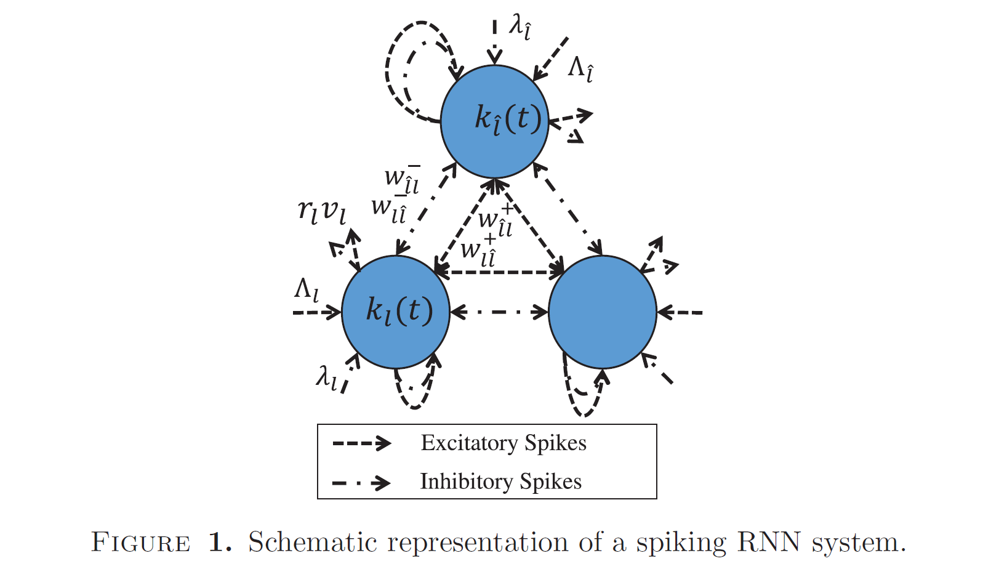

# 节选自RANDOM NEURAL NETWORK METHODS AND DEEP LEARNING 

## Model description

> Within the RNN system with $L$ neurons, all neurons communicate with each other with stochastic unit amplitude spikes while receiving external spikes. The potential of the $l\text{-th}$ neuron, denoted by $k(t) \ge 0$, is dynamically changing in continuous time, and the $l\text{-th}$ neuron is said to be excited if its potential $k(t)$ is larger than zero. An excitatory spike arrival to the $l\text{-th}$ neuron increases its potential by $1$, denoted by $k(t+) ← k(t) + 1$; while an inhibitory spike arrival decreases its potential by $1$ if it is larger than zero, denoted by $k(t+) ← max(k(t) − 1, 0)$, where $max(a, b)$ produces the larger element between $a$ and $b$.

在一个RNN系统内部有L个神经元，在接受到外部脉冲时，所有的神经元都与其他神经元以随机单元振幅脉冲的方式通信。第l个神经元的潜力，记为$k(t) \ge 0$，它会在连续时间内被动态改变，并且第$l$个神经元被称为兴奋，如果它的$k(t)$大于0的话。一个兴奋脉冲到达第l个神经元时会使他的潜力增加$1$，记为$k(t+) ← k(t) + 1$；当一个抑制脉冲到达时会使它的潜力减$1$（如果潜力大于$1$的话），记为$k(t+) ← max(k(t) − 1, 0)$，其中$max(a,b)$返回元素$a$和$b$中大的那个。

> For better illustration, Figure 1 presents the schematic representation of the RNN system. Excitatory spikes arrive at the $l\text{-th}$ neuron from the outside world according to Poisson processes of rate $Λ_l$, which means that the probability that there are $ρ$ excitatory spike arrivals in time interval $Δt$ is [87]: $Prob(ρ \ \text{spike arrivals in interval} \ Δt) = (Λ_l Δt)^ρe^{−ΛlΔt}/ρ!$, where $ρ$ is a non-negative integer. In addition, the rate of inhibitory Poisson spike arrivals from the outside world to the $l\text{-th}$ neuron is $λ_l$. When the $l\text{-th}$ neuron is excited, it may fire excitatory or inhibitory spikes toward other neurons with the inter-firing interval $\bar{\rho}$ being exponentially distributed, which means that the probability density function of $\bar{ρ}$ is $\text{Prob}(\bar{ρ} = Δt) = r_le^{−r_lΔt}$, where $r_l$ is the firing rate of the $l\text{-th}$ neuron. When the $l\text{-th}$ neuron fires a spike, its potential is decreased by 1. The fired spike heads for the $\hat{l}\text{-th}$ neuron as an excitatory spike with probability $p^+_{l,\hat{l}}$ or as an inhibitory spike with probability $p^-_{l,\hat{l}}$ , or it departs from the network/system with probability $ν_l$. The summation of these probabilities is 1: $\sum^L_{\hat{l} =1}(p^+_{l,\hat l} + p^−_{l,\hat l} ) + ν_l = 1$.

为了更好地说明，图1给出了RNN系统的示意图。兴奋性峰值根据速率$Λ_l$的泊松过程从外部世界到达$ l \text {-th} $个神经元，这意味着在时间间隔$Δt$中$ρ$个兴奋性峰值到达的概率为[87]：$Prob(ρ \ \text{spike arrivals in interval} \ Δt) = (Λ_l Δt)^ρe^{−ΛlΔt}/ρ!$，其中$ρ$是一个非负整数。另外，抑制性泊松脉冲从外部到达$ l \text{-th} $神经元的速率为$λ_l$。 当第$l$个神经元兴奋时，他可能会以间隔为$\bar{\rho}$的指数分布发射兴奋或抑制脉冲到其他神经元，这意味着$\bar{\rho}$的概率密度函数是$\text{Prob}(\bar{ρ} = Δt) = r_le^{−r_lΔt}$，其中$r_l$是第$l$个神经元的发射率。当第$l$个神经元发射脉冲，他的潜力将减1。发射脉冲到第$\hat{l}$个神经元作为兴奋脉冲，概率$p^+_{l,\hat{l}}$，或作为抑制脉冲，概率$p^-_{l,\hat{l}}$，或者它以概率$ν_l$离开这个网络/系统。这些概率的总和是1：$\sum^L_{\hat{l} =1}(p^+_{l,\hat l} + p^−_{l,\hat l} ) + ν_l = 1$

-----

注：

上述的公式即为泊松过程，设$N(t)$表示时间$time \in [0,t]$内发生时间的次数，那么对于任意时刻$s$泊松过程即为：
$$
P(N(t+s)-N(s)=k)=\frac{(\lambda t)^{k}e^{-\lambda t}}{k!}
$$
其中，时间间隔$t$内事件发生个数服从均值为$\lambda t$泊松分布，

$\lambda$ 是泊松过程的速率，或称单位时间内事件发生的平均次数

-----

> Evidently, the potentials of the $L$ neurons in the system are dynamically changing over time due to the stochastic spikes and firing events. Let $\text{Prob}(k_l(t) > 0)$ denote the probability that the $l\text{-th}$ neuron is excited at time $t$. Accordingly, let $q_l =\lim_{t\rightarrow\infin} Prob(k_l(t) > 0)$ denote stationary excitation probability of the $l\text{-th}$ neuron. Due to the stochastic and distributed nature of the behaviors of the whole spiking neural system, it is difficult to obtain the value of $q_l$. For a system with fixed configurations and inputs, a straightforward method is to estimate the value of $q_l$ by using the Monte Carlo method. However, this method may not enable us to obtain a good estimation of $q_l$ or be applicable when the number of neurons becomes very large.

显然，由于随机脉冲和发射事件，系统中$ L $神经元的电势随时间动态变化。令$\text{Prob}(k_l(t)> 0)$表示$ l\text {-th} $个神经元在时间$ t $被兴奋的概率。因此，令$q_l =\lim_{t\rightarrow\infin} Prob(k_l(t) > 0)$表示$ l\text{-th} $个神经元的平稳兴奋概率。由于整个脉冲神经系统的行为具有随机性和分布性，因此很难获得$q_l$的值。对于具有固定配置和输入的系统，一种直接的方法是通过使用蒙特卡洛方法来估计$ q_l$的值。但是，这种方法可能无法使我们获得$q_l$良好的估计值，或者在神经元数量变得非常大时不适用。

> In [42], Gelenbe presented important results on the excitation probabilities of the neurons of this RNN system. It is proven in [42,45,49] that $q_l =\lim_{t\rightarrow\infin} Prob(k_l(t) > 0)$ can be directly calculated by the following system of equations:
> $$
> q_l=min\left( 
> \frac{\lambda_l^+}{r_l+\lambda_l^-},1
> \right)
> \quad  \quad \quad \quad \quad \quad \quad(1)
> $$
> where $\lambda_l^+=\Lambda_l+\sum^N_{\hat{l}=1}q_{\hat{l}}w^+_{\hat{l},l}$ , $\lambda_l^-=\lambda_l+\sum^N_{\hat{l}=1}q_{\hat{l}}w^-_{\hat{l},l}$ , $w^+_{\hat{l},l}=r_{\hat l}p^+_{\hat l,l}$ , $w^-_{\hat{l},l}=r_{\hat l}p^-_{\hat l,l}$ and $l = 1,..., L$. Here $Λ_l$ and $λ_l$ are respectively the arrival rates of external excitatory and inhibitory spikes and $r_l$ is the firing rate of the $l\text{-th}$ neuron. In addition, $\sum^L_{\hat{l} =1}(p^+_{l,\hat l} + p^−_{l,\hat l} ) + ν_l = 1$. Operation $min(a, b)$ produces the smaller one between a and b. In [49], it was shown that the system of N non-linear eq. (1)  have a solution which is unique. Therefore, the states of the RNN can be efficiently obtained by solving a system of equations without requiring the Monte Carlo method [116].

在[42]中，Gelenbe提出了关于该RNN系统神经元激发概率的重要结果。在[42,45,49]中证明，$q_l =\lim_{t\rightarrow\infin} Prob(k_l(t) > 0)$可以通过以下方程组直接计算：
$$
q_l=min\left(  \frac{\lambda_l^+}{r_l+\lambda_l^-},1 \right) \quad  \quad \quad \quad \quad \quad \quad(1)
$$
其中，$\lambda_l^+=\Lambda_l+\sum^N_{\hat{l}=1}q_{\hat{l}}w^+_{\hat{l},l}$ , $\lambda_l^-=\lambda_l+\sum^N_{\hat{l}=1}q_{\hat{l}}w^-_{\hat{l},l}$ , $w^+_{\hat{l},l}=r_{\hat l}p^+_{\hat l,l}$ , $w^-_{\hat{l},l}=r_{\hat l}p^-_{\hat l,l}$ 并且 $l = 1,..., L$。$Λ_l$ 和 $λ_l$ 表示外部兴奋和抑制脉冲的到达率，$r_l$是第$l$个神经元的发射率。额外的，$\sum^L_{\hat{l} =1}(p^+_{l,\hat l} + p^−_{l,\hat l} ) + ν_l = 1$。运算符$min(a, b)$产生a和b之中小的那个。在[49]中，它展示了N个非线性方程$(1)$的解是唯一的。因此，通过求解方程组可以有效地获得RNN的状态，而无需使用蒙特卡洛方法[116]。

> The RNN’s approximation property shows that it is a function approximator with the universal approximation property (UAP). In particular, in [74,75,78], it is shown that, for any continuous real-valued and bounded function $f(X) : [0, 1]1×N → \mathbb{R}$, there exists an RNN that approximates $f(X) $ uniformly on $[0, 1]^{1×N}$. The work in [157] presents a constructive proof for this UAP theorem that lays a theoretical basis for the learning capability of the RNN and its capability for DL. The RNN function approximator is demonstrated to have a lower computational complexity than the orthogonal–polynomial function approximator in [163] and the one-hidden-layer MLP. The RNN function approximator, equipped with the proposed configuration/learning procedure, is then applied as a tool for solving patternclassification problems. Numerical experiments on various datasets demonstrate that the RNN classifier is more efficient than the Chebyshev-polynomial neural network [163], ELM [94], MLP equipped with the Levenberg–Marquardt (LM) algorithm, radial-basis-function neural networks [152,160], and support vector machine [24].

RNN的逼近属性表明它是具有通用逼近属性（UAP）的函数逼近器。特别是，在[74,75,78]中，对于任何连续的实值和有界函数$f(X) : [0, 1]1×N → \mathbb{R}$，存在在$ [0,1] ^ {1×N} $上均匀地近似$ f(X)$的RNN。[157]中的工作为该UAP定理提供了建设性的证明，为RNN的学习能力及其DL的能力奠定了理论基础。与[163]和单层MLP中的正交多项式函数逼近器相比，RNN函数逼近器具有更低的计算复杂度。然后，将配备有建议的配置/学习过程的RNN函数逼近器用作解决模式分类问题的工具。在各种数据集上的数值实验表明，RNN分类器比 Chebyshev多项式神经网络[163]，ELM [94]，配备了 Levenberg–Marquardt (LM)算法的MLP，径向基函数神经网络，以及支持向量机[24]更有效。

